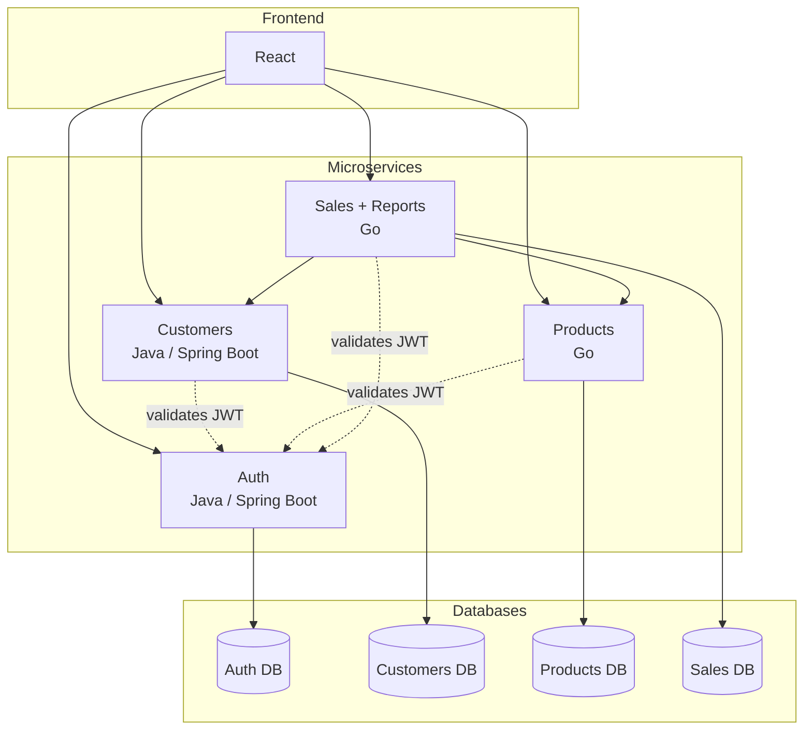
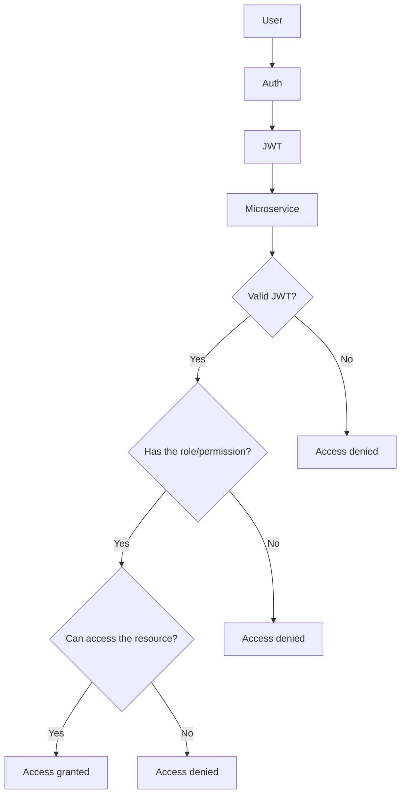

# Preliminary Design Review (PDR)
## Sales Management System — SynkroTech SAS

**Version:** 1.0
**Date:** August 2026
**Subject:** Distributed Systems
**Status:** Preliminary — for review and approval

---

## Team Members

| Full Name | GitHub User |
|------------|------------|
| Sergio Andres Ordoñez Diaz | https://github.com/SergioAndres17 |
| Fredman Santiago Plazas Artunduaga | https://github.com/SantiagoPlazas2005 |
| Jordan Ramirez Gallego | https://github.com/JordanRG420 |
| Angel Gustavo Solano Trujillo | https://github.com/AsolanoT |

---

## Contribution Distribution by Member

| HU ID | Responsible | PDR Points | Title |
|---|---|---|---|
| **HU-PDR-01** | Jordan Ramirez Gallego | 1–3 | Define the purpose, business context, and scope of the project |
| **HU-PDR-02** | Angel Gustavo Solano Trujillo | 4–5 | Define functional/non-functional requirements and preliminary architecture |
| **HU-PDR-03** | Sergio Andrés Ordóñez Díaz | 6–7 | Define the preliminary data model and interfaces (APIs) |
| **HU-PDR-04** | Fredman Santiago Plazas Artunduaga | 8–12 | Define risks, work plan, acceptance criteria, next steps, and business glossary |

## 1. Purpose of the Document

**SynkroTech SAS** is a medium-sized company dedicated to the sale of technology products and electronic accessories, such as computers, laptops, peripherals, components, storage devices, and connectivity equipment. Due to sales growth and an increasing number of catalog references, the company needs a solution that allows it to centrally manage information about customers, products, inventory, and business transactions.

Currently, sales and stock control are carried out using scattered tools and manual processes, which makes it difficult to accurately know product availability, customer purchase history, and sales performance. The main need is to have a system that manages inventory, records sales efficiently, maintains traceability of operations, and generates reports that support business decision-making.

This document aims to define and justify the preliminary design of the Sales Management System for SynkroTech SAS. Its purpose is to establish a clear vision of the proposed technological solution before beginning the detailed design and implementation phases.

The document serves as a reference point for all members of the development team, providing a shared understanding of the system's objectives and the functionalities to be implemented throughout the project.

The main objectives of this document are:

- Clearly define the business problem.
- Identify the needs that drive the development of the system.
- Establish the scope of the proposed solution.
- Provide a basis for design and implementation decisions.
- Reduce misunderstandings among team members and project stakeholders.
- Serve as a preliminary review document prior to the development of the microservices and the web application.

---

## 2. Background and Need

SynkroTech SAS has experienced sustained growth in its sales and in the number of references in its technology product catalog. This growth has exposed the limitations of its current tools, based on manual processes and disconnected systems (spreadsheets, physical records, isolated applications), which results in:

- Scattered information with no single source of truth.
- Poor inventory and stock control.
- Human errors in sales calculations.
- Absence of transaction history.
- Lack of data for decision-making (reports).
- Nonexistent access control.

**Core need:** to have a system that centralizes customers, products, and sales; automates calculations and stock control; maintains traceability of transactions; and provides useful reports for the commercial and administrative management of SynkroTech SAS, all under a secure access scheme.

## Identified Problems

The following problems have been identified in the day-to-day management of SynkroTech SAS:

### Inefficient Inventory Management

Manual stock control can lead to discrepancies between the actual quantity of available products and the recorded inventory, resulting in financial losses or customer service issues.

### Scattered Information

Customer, product, and sales data are often stored in different locations, making it difficult to quickly access accurate and up-to-date information.

### Errors in Sales Calculations

When sales figures are calculated manually, there is a higher risk of errors in quantities, subtotals, and final totals.

### Lack of Traceability

In many cases, there is no reliable record showing who made a sale, when it occurred, or which products were included in the transaction.

### Limited Analytical Capabilities

The absence of automated reports makes it difficult to answer important business questions such as:

- How much was sold during the day?
- Which month had the highest sales volume?
- Which are the best-selling products?
- Which customers purchase most frequently?

### Insufficient Security

Many small businesses lack formal authentication and access control mechanisms, allowing unauthorized users to access or modify sensitive information.

---

## Business Need

There is a need to implement a technological solution that centralizes SynkroTech SAS's business operations within a single platform.

The system must allow for the management of customers, products, and inventory, enable secure sales recording, and provide useful information to support the company's business decision-making.

---

## 3. Project Scope

The project involves the development of a web application focused on managing customers, products, inventory, and sales for SynkroTech SAS.

The solution will be implemented using a microservices architecture with REST API communication and a web interface developed in React.

### 3.1 Included in Scope
- Customer management (register, update, search, delete).
- Product and inventory management (stock, price, categories).
- Sales recording with customer and product association, and automatic total calculation.
- Sales reports by day, by month, and of best-selling products.
- Authentication and authorization via JWT.
- Web interface developed in React.

### 3.2 Out of Scope (for this phase of the project)
- Real payment gateways (cards, external gateways).
- Electronic invoicing with legal validity before government entities.
- Mobile application.
- Multiple branches or warehouses (SynkroTech SAS currently operates a single site).

---

## 4. Requirements

### 4.1 Functional Requirements

| ID | Description |
|---|---|
| RF-01 | The system must allow registering, updating, searching for, and deleting customers. |
| RF-02 | The system must allow registering products with name, price, stock, and category. |
| RF-03 | The system must allow updating product stock. |
| RF-04 | The system must allow creating a sale associating a customer and one or more products. |
| RF-05 | The system must automatically calculate the total for each sale. |
| RF-06 | The system must validate the existence of the customer and stock availability before confirming a sale. |
| RF-07 | The system must generate daily sales reports. |
| RF-08 | The system must generate monthly sales reports. |
| RF-09 | The system must generate a report of the best-selling products. |
| RF-10 | The system must authenticate users via JWT before allowing operations on the data. |

### 4.2 Non-Functional Requirements

| ID | Description |
|---|---|
| RNF-01 | **Modularity:** each business domain must be implemented as an independent microservice, following hexagonal architecture. |
| RNF-02 | **Distributed persistence:** each microservice must have its own PostgreSQL database, with no direct access to other services' databases. |
| RNF-03 | **Interoperability:** communication between microservices must be carried out via REST API (and optionally asynchronous messaging). |
| RNF-04 | **Security:** sensitive operations must require a valid JWT token. |
| RNF-05 | **Development availability:** each microservice must be deployable and testable independently (Docker containers). |
| RNF-06 | **Conceptual scalability:** the design must, in theory, allow each service to scale independently according to its load. |
| RNF-07 | **Maintainability:** the code must clearly separate domain, use cases, and adapters (hexagonal principle). |

---

## 5. Architecture Design (Preliminary)

The system is composed of **4 independent microservices**, each with its own PostgreSQL database, communicating with each other via HTTP requests and optionally via asynchronous messaging. All services expose their functionality through **REST APIs**, consumed by a web interface developed in **React**.

> **Design note:** the Reports service was integrated into the Sales service (it is not an independent microservice), and the Auth service now takes the fourth place as its own business microservice, rather than being a cross-cutting component external to the 4 backend repos.

### 5.1 System Overview

### Overview

The four main microservices will be:

1. **Auth** — Registration/login of system users, JWT issuance and management, roles and permissions.
2. **Customers** — Registration, update, search, and deactivation of SynkroTech SAS customers.
3. **Products** — Product catalog, categories, and stock/inventory control.
4. **Sales** — Recording of sales and their details, orchestration with Customers and Products, and generation of reports (daily, monthly, top products).

The following will be handled as cross-cutting concerns:

- RabbitMQ as a messaging mechanism (advanced phase, optional).

Authentication and authorization are managed using **JWT**, required on all routes involving operations on business data, except the registration/login routes exposed by Auth.

### 5.2 System Components (Microservices)

| Component | Technology | Database | Responsibility |
|---|---|---|---|
| Frontend | React | — | User interface, consumption of REST APIs |
| Auth Service | Java (Spring Boot) | PostgreSQL `auth_db` | User registration/login, JWT issuance and validation, role and permission management |
| Customers Service | Java (Spring Boot) | PostgreSQL `clientes_db` | Management of customer data |
| Products Service | Go | PostgreSQL `productos_db` | Management of catalog, categories, and stock |
| Sales Service | Go | PostgreSQL `ventas_db` | Sales orchestration, total calculation, report generation |

### 5.3 Internal Architectural Pattern (per Microservice)

Each microservice is designed following the **hexagonal architecture (Ports and Adapters)** pattern, which aims to isolate business logic from external technical details (frameworks, databases, communication protocols). It consists of three layers:

- **Domain:** pure entities and business rules, with no dependencies on external frameworks or libraries.
- **Application (use cases):** orchestrates business logic and defines **ports** — interfaces that declare what the domain needs (e.g., a customer repository) or what it exposes externally.
- **Infrastructure (adapters):** concrete implementations of those ports. Includes:
  - *Inbound adapters:* REST controllers that receive HTTP requests and translate them into use case calls.
  - *Outbound adapters:* repositories that implement persistence in PostgreSQL, and HTTP clients that allow one service to consume another (e.g., Sales calling Customers).

### 5.4 Communication Between Services

- **Initial phase (project baseline):** **synchronous communication via REST/HTTP**.
  - *Sales → Customers*: validate customer existence.
  - *Sales → Products*: validate stock and obtain price, and update stock after the sale.
  - *Customers, Products, Sales → Auth*: local JWT validation (signature verification with the public key), without needing a synchronous call for every request.
- **Advanced phase (optional, greater complexity and pedagogical value):** **event-based asynchronous communication** (RabbitMQ), where Sales publishes a `venta_creada` (sale created) event that other services can consume.

### 5.5 Auth, JWT, and Security

The **Auth** service is developed in **Java (Spring Boot)** and is the only microservice responsible for issuing JWT tokens. The other services (Customers, Products, Sales) **do not issue tokens**, they only validate them.

**Main Auth functions:**

- Registration of system users (SynkroTech SAS employees: administrators, salespeople, inventory staff).
- Login (`POST /api/auth/login`).
- Generation of `access_token` (JWT) and `refresh_token`.
- Token renewal (`POST /api/auth/refresh`).
- Role and permission management.

**Authentication flow:**

1. The user sends their credentials to Auth.
2. Auth validates them against `auth_db` and, if correct, signs a JWT with its private key (**RS256** algorithm) that includes: `sub` (user id), `roles`, `permisos` (permissions), `iat`, `exp`.
3. The JWT is sent with every subsequent request via the `Authorization: Bearer <token>` header.
4. Each of the other 3 microservices validates the JWT **locally**, using Auth's public key, without needing to call Auth on every request. This reduces coupling and latency between services.
5. If the `access_token` expires, the frontend requests a new one from Auth using the `refresh_token`.

**System roles:**

| Role | Permissions |
|---|---|
| **ADMIN** | Full access: management of users and roles, customers, products, sales, and reports |
| **VENDEDOR (Salesperson)** | Manages customers, creates sales, checks stock, views reports of their own sales |
| **INVENTARIO (Inventory)** | Manages products, categories, and stock; no access to customers or sales |

Each microservice is responsible for enforcing the corresponding permissions on its own resources, based on the `roles`/`permisos` included in the JWT.

---

## 6. Preliminary Data Model
The system will use an independent database for each microservice. Each service will be responsible for managing and persisting only the information belonging to its own domain.

## 6.1 Auth Service — Auth DB

### Table: usuarios (users)

* `usuario_id` (PK)
* `nombre` (name)
* `correo` (email)
* `password_hash`
* `rol` (role: ADMIN, VENDEDOR, INVENTARIO)
* `fecha_registro` (registration date)
* `estado` (boolean, true = active, false = inactive) "this is so records aren't deleted directly from the databases, only the record's status is changed"

### Table: refresh_tokens

* `token_id` (PK)
* `usuario_id` (FK)
* `token`
* `fecha_expiracion` (expiration date)
* `estado` (boolean, true = active, false = inactive) "this is so records aren't deleted directly from the databases, only the record's status is changed"

This database stores SynkroTech SAS's internal users (employees) who log into the system, along with their roles and current refresh tokens. It is a domain distinct from `clientes` (customers/buyers).

## 6.2 Customers Service — Customers DB

### Table: clientes (customers)

* `cliente_id` (PK)
* `nombre` (name)
* `documento_identidad` (ID document)
* `correo` (email)
* `telefono` (phone)
* `direccion` (address)
* `fecha_registro` (registration date)
* `estado` (boolean, true = active, false = inactive) "this is so records aren't deleted directly from the databases, only the record's status is changed"

This table stores the basic information of customers registered in the system.

## 6.3 Products Service — Products DB

### Table: productos (products)

* `producto_id` (PK)
* `nombre` (name)
* `precio` (price)
* `stock`
* `categoria_id` (FK)
* `estado` (boolean, true = active, false = inactive) "this is so records aren't deleted directly from the databases, only the record's status is changed"

### Table: categorias (categories)

* `categoria_id` (PK)
* `nombre` (name)
* `estado` (boolean, true = active, false = inactive) "this is so records aren't deleted directly from the databases, only the record's status is changed"

The `productos` table stores the product catalog and available stock. The relationship with `categorias` is maintained within the same database via a foreign key.

## 6.4 Sales Service — Sales DB (includes Reports)

### Table: ventas (sales)

* `venta_id` (PK)
* `cliente_id` (external reference, validated via API)
* `fecha` (date)
* `total`
* `estado` (boolean, true = active, false = inactive) "this is so records aren't deleted directly from the databases, only the record's status is changed"

### Table: detalle_venta (sale detail)

* `detalle_id` (PK)
* `venta_id` (FK)
* `producto_id` (external reference, validated via API)
* `cantidad` (quantity)
* `precio_unitario` (unit price)
* `subtotal`
* `estado` (boolean, true = active, false = inactive) "this is so records aren't deleted directly from the databases, only the record's status is changed"

### Table: resumen_ventas (sales summary)

* `fecha` (date)
* `total_ventas_dia` (total daily sales)
* `total_ventas_mes` (total monthly sales)
* `producto_id`
* `cantidad_vendida` (quantity sold)
* `estado` (boolean, true = active, false = inactive) "this is so records aren't deleted directly from the databases, only the record's status is changed"

The `ventas` table stores the general information of each sale, `detalle_venta` contains the products associated with each transaction, and `resumen_ventas` stores the aggregated information required for daily, monthly, and best-selling-product reports (this last table corresponds to the Reports functionality, now integrated into the Sales service).

The `cliente_id` and `producto_id` fields are not real foreign keys because they belong to databases managed by other microservices. Their existence will be validated through service-to-service communication.

> **Distributed design note:** Each microservice has its own PostgreSQL database and has no direct access to another service's database. References between domains are handled through API communication, maintaining each service's independence.

---

## 7. Interfaces (APIs) — Preliminary

| Service | Endpoint (example) | Method | Description |
|---|---|---|---|
| Auth | `/api/auth/register` | POST | Register a system user |
| Auth | `/api/auth/login` | POST | Log in and obtain JWT |
| Auth | `/api/auth/refresh` | POST | Renew access token |
| Customers | `/api/clientes` | POST | Register a customer |
| Customers | `/api/clientes/{id}` | GET | Look up a customer |
| Customers | `/api/clientes/{id}` | PUT | Update a customer |
| Customers | `/api/clientes/{id}` | DELETE | Delete a customer |
| Products | `/api/productos` | POST | Register a product |
| Products | `/api/productos/{id}/stock` | PATCH | Update stock |
| Sales | `/api/ventas` | POST | Create a sale |
| Sales | `/api/ventas/{id}` | GET | View sale detail |
| Sales | `/api/ventas/reportes/diario` | GET | Daily sales report |
| Sales | `/api/ventas/reportes/mensual` | GET | Monthly sales report |
| Sales | `/api/ventas/reportes/top-productos` | GET | Best-selling products |

### Communication Between Services

* **Sales → Customers:** Validate the customer's existence before creating a sale.
* **Sales → Products:** Validate stock availability, obtain the product's price, and update stock after the sale.
* **Customers, Products, Sales → Auth:** Local JWT validation (signature verification with Auth's public key) on every protected request.

All routes, except `/api/auth/register` and `/api/auth/login`, will require a valid JWT token via the following header:

`Authorization: Bearer <token>`

---

## 8. Identified Risks and Mitigation

| Risk | Probability | Impact | Mitigation |
|---|---|---|---|
| Communication between services generates strong coupling | Medium | Medium | Strict use of ports/interfaces; timeouts and error handling in HTTP calls |
| Data inconsistency between services (stock sold vs. available) | Medium | High | Validate stock at the time of sale; consider an atomic operation or compensation |
| Complexity of asynchronous messaging (advanced phase) | Medium | Low | Treat it as an optional enhancement, not a mandatory initial requirement |
| Human or calculation error in the net balance (income − expenses) | Low | High | Perform unit tests on the calculation logic; validate with manual test cases before integrating with the frontend |
| Delays due to simultaneous learning curve (Go + hexagonal + JWT) | High | High | Schedule with progressive phases (see section 9) |
| Auth as the sole JWT issuer is a critical point: if it fails, no service can validate new sessions | Low | High | Services validate the JWT locally with the public key (they don't depend on Auth for every request); only login and refresh depend on Auth's availability |

---

## 9. Preliminary Work Plan

| Phase | Activity | Deliverable |
|---|---|---|
| 1 | Training in Go and hexagonal architecture; definition of base templates | Java and Go hexagonal template |
| 2 | Development of the Auth Service (registration, login, JWT, roles) | Functional microservice + `auth` DB |
| 3 | Development of the Customers Service | Functional microservice + `clientes` DB |
| 4 | Development of the Products Service | Functional microservice + `productos` DB |
| 5 | Development of the Sales Service (includes HTTP integration with Customers and Products, and reports) | Functional microservice + `ventas` DB |
| 6 | Development of the React Frontend, integrating the 4 services | Functional interface |
| 7 | End-to-end integration testing (login → record transaction → view summary) | Test report |
| 8 | Final documentation and presentation preparation | Technical document + demo |

---

## 10. PDR Acceptance Criteria

The preliminary design is considered accepted if:
- The team understands and validates the proposed hexagonal architecture for each service.
- The functional and non-functional requirements are considered complete and correct.
- The preliminary data model is sufficient to begin detailed design.
- The identified risks have a mitigation strategy accepted by the team.
- There are no evident technical blockers to begin implementation.

---

## 11. Next Steps

1. Validate this PDR with the project instructor/client.
2. Define the hexagonal folder template for Java and Go (Critical Design).
3. Set up repositories (4 backend, 4 frontend/config, 4 databases) and container environments (Docker).
4. Begin Phase 1 of the work plan.

---

## 12. Business Glossary

| Term | Definition |
|---|---|
| **Microservice** | An independent software component that implements a specific business domain, with its own database and deployment cycle. |
| **Hexagonal Architecture (Ports and Adapters)** | A design pattern that isolates business logic (domain) from external technical details such as frameworks, databases, or communication protocols. |
| **Port** | An interface defined by the application layer that declares what the domain needs or exposes, without specifying its technical implementation. |
| **Adapter** | A concrete implementation of a port. Can be inbound (e.g., a REST controller) or outbound (e.g., a database repository, an HTTP client). |
| **Domain** | The set of entities and pure business rules of a service, with no dependencies on external frameworks. |
| **Use Case** | A concrete business operation that orchestrates the domain rules (e.g., "Create sale," "Update stock"). |
| **Bounded Context** | The conceptual boundary within which a domain model is consistent (e.g., "Customer" in the Sales context may differ from "User" in the Auth context). |
| **JWT (JSON Web Token)** | A digitally signed token that carries user information (identity, roles, permissions) to authenticate and authorize requests without needing a server-side session. |
| **Access Token** | A short-lived JWT token used to authorize requests to the microservices. |
| **Refresh Token** | A longer-lived token used to obtain a new access token without requiring the user to log in again. |
| **Role** | A category assigned to a system user (ADMIN, VENDEDOR, INVENTARIO) that determines which operations they can perform. |
| **Permission** | A specific authorization over a particular resource or action, associated with one or more roles. |
| **Claim** | A piece of data included in a JWT's payload (e.g., `sub`, `roles`, `exp`). |
| **REST API** | An interface for communication between services based on the HTTP protocol, using standard methods (GET, POST, PUT, DELETE, PATCH). |
| **Stock** | The available quantity of a product in SynkroTech SAS's inventory. |
| **Distributed Persistence** | A strategy in which each microservice manages its own database, without sharing it with other services. |
| **Container (Docker)** | A packaged software unit that includes the application and its dependencies, allowing independent deployment of each microservice. |
| **Authentication** | The process of verifying a user's identity (who are you?). |
| **Authorization** | The process of verifying whether an authenticated user has permission to perform an action (what can you do?). |
| **RF / RNF** | Functional Requirement / Non-Functional Requirement. |
| **PDR (Preliminary Design Review)** | A preliminary design review document, prior to detailed design and implementation. |
