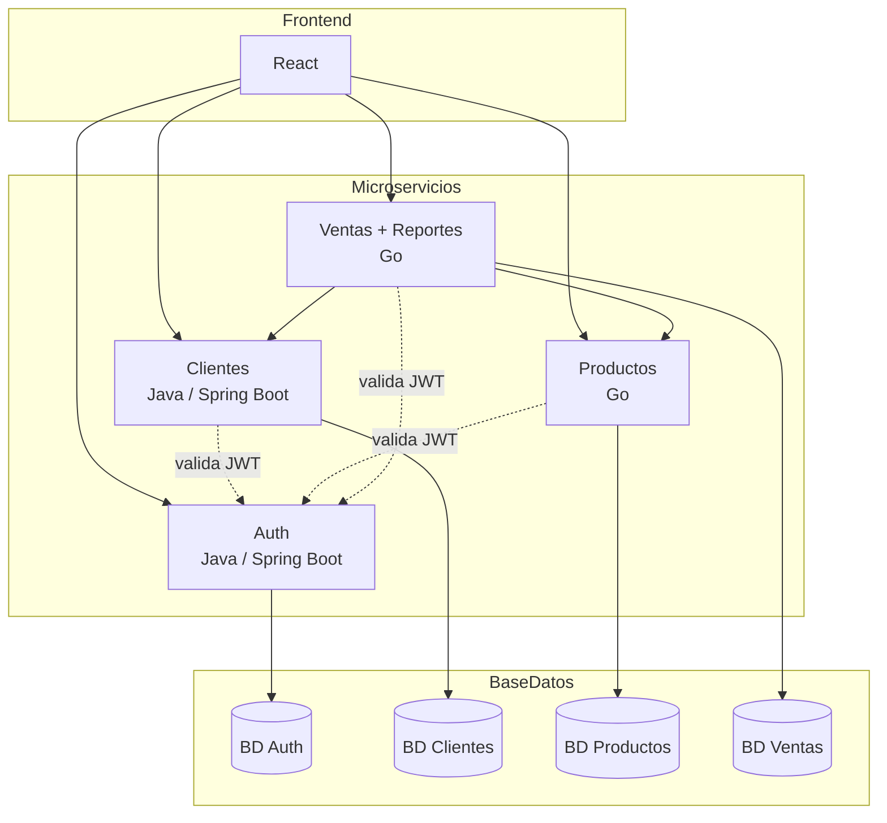
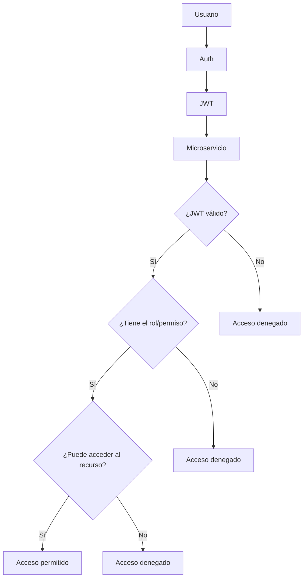

# Preliminary Design Review (PDR)
## Sales Management System — SynkroTech SAS

**Version:** 1.0
**Date:** August 2026
**Course:** Distributed Systems
**Status:** Preliminary — for review and approval

---

## Team Members

| Full Name | GitHub User |
|------------|------------|
| Sergio Andres Ordoñez Diaz | https://github.com/SergioAndres17 |
| Fredman Santiago Plazas Artunduaga | https://github.com/SantiagoPlazas2005 |
| Jordan Ramirez Gallego | https://github.com/JordanRG420 |
| Angel Gustavo Solano Trujillo | https://github.com/AsolanoT |

---

## Contribution Distribution by Member

| HU ID | Responsable | Puntos del PDR | Título |
|---|---|---|---|
| **HU-PDR-01** | Jordan Ramirez Gallego | 1–3 | Define purpose, business context, and project scope |
| **HU-PDR-02** | Angel Gustavo Solano Trujillo | 4–5 | Define functional/non-functional requirements and preliminary architecture |
| **HU-PDR-03** | Sergio Andrés Ordóñez Díaz | 6–7 | Define the preliminary data model and interfaces (APIs) |
| **HU-PDR-04** | Fredman Santiago Plazas Artunduaga | 8–12 | Define risks, work plan, acceptance criteria, next steps, and business glossary |

## 1. Document Purpose

**SynkroTech SAS** es una empresa mediana dedicada a la comercialización de productos tecnológicos y accesorios electrónicos, como computadores, portátiles, periféricos, componentes, dispositivos de almacenamiento y equipos de conectividad. Debido al crecimiento de las ventas y al aumento de referencias en su catálogo, la empresa necesita una solución que le permita administrar de manera centralizada la información de clientes, productos, inventario y transacciones comerciales.

Actualmente, el control de ventas y existencias se realiza mediante herramientas dispersas y procesos manuales, lo que dificulta conocer con precisión la disponibilidad de productos, el historial de compras de los clientes y el rendimiento de las ventas. La necesidad principal es contar con un sistema que permita gestionar el inventario, registrar ventas de forma eficiente, mantener trazabilidad de las operaciones y generar reportes que apoyen la toma de decisiones comerciales.

Este documento tiene como objetivo definir y justificar el diseño preliminar del Sistema de Gestión de Ventas para SynkroTech SAS. Su propósito es establecer una visión clara de la solución tecnológica propuesta antes de iniciar las fases de diseño detallado e implementación.

El documento sirve como punto de referencia para todos los miembros del equipo de desarrollo, proporcionando una comprensión compartida de los objetivos del sistema y las funcionalidades que deben implementarse a lo largo del proyecto.

Los objetivos principales de este documento son:

- Definir claramente el problema empresarial.
- Identificar las necesidades que motivan el desarrollo del sistema.
- Establecer el alcance de la solución propuesta.
- Proporcionar una base para las decisiones de diseño e implementación.
- Reducir malentendidos entre los miembros del equipo y las partes interesadas del proyecto.
- Servir como documento de revisión preliminar antes del desarrollo de los microservicios y la aplicación web.

---

## 2. Background and Need

SynkroTech SAS ha experimentado un crecimiento sostenido en sus ventas y en el número de referencias de su catálogo de productos tecnológicos. Este crecimiento ha evidenciado las limitaciones de sus herramientas actuales, basadas en procesos manuales y sistemas desarticulados (hojas de cálculo, registros físicos, aplicaciones aisladas), lo que genera:

- Información dispersa y sin fuente única de verdad.
- Control deficiente de inventario y stock.
- Errores humanos en el cálculo de ventas.
- Ausencia de historial de transacciones.
- Falta de datos para la toma de decisiones (reportes).
- Control de acceso inexistente.

**Necesidad central:** contar con un sistema que centralice clientes, productos y ventas, automatice cálculos y control de stock, mantenga trazabilidad de las transacciones y provea reportes útiles para la gestión comercial y administrativa de SynkroTech SAS, todo bajo un esquema de acceso seguro.

## Identified Problems 

Se han identificado los siguientes problemas en la gestión diaria de SynkroTech SAS:

### Inefficient Inventory Management

El control manual del stock puede llevar a discrepancias entre la cantidad real de productos disponibles y el inventario registrado, resultando en pérdidas financieras o problemas de servicio al cliente.

### Dispersed Information

Los datos de clientes, productos y ventas se almacenan a menudo en ubicaciones diferentes, lo que dificulta el acceso rápido a información precisa y actualizada.

### Sales Calculation Errors

Cuando los valores de ventas se calculan manualmente, existe un mayor riesgo de errores en cantidades, subtotales y totales finales.

### Lack of Traceability

En muchos casos, no existe un registro confiable que muestre quién realizó una venta, cuándo ocurrió o qué productos se incluyeron en la transacción.

### Limited Analytical Capabilities

La ausencia de informes automatizados dificulta responder preguntas empresariales importantes como:

- ¿Cuánto se vendió durante el día?
- ¿Cuál fue el mes con mayor volumen de ventas?
- ¿Cuáles son los productos más vendidos?
- ¿Qué clientes realizan compras con mayor frecuencia?

### Insufficient Security

Muchas pequeñas empresas carecen de mecanismos formales de autenticación y control de acceso, permitiendo que usuarios no autorizados accedan o modifiquen información sensible.

---

## Business Need

Existe la necesidad de implementar una solución tecnológica que centralice las operaciones comerciales de SynkroTech SAS dentro de una única plataforma.

El sistema debe permitir la gestión de clientes, productos e inventario, habilitar el registro seguro de ventas y proporcionar información útil para apoyar la toma de decisiones comerciales de la empresa.

---

## 3. Project Scope

El proyecto implica el desarrollo de una aplicación web enfocada en la gestión de clientes, productos, inventario y ventas para SynkroTech SAS.

La solución se implementará utilizando una arquitectura de microservicios con comunicación REST API e interfaz web desarrollada en React.

### 3.1 In Scope
- Gestión de clientes (registrar, actualizar, buscar, eliminar).
- Gestión de productos e inventario (stock, precio, categorías).
- Registro de ventas con asociación de cliente y productos, y cálculo automático de totales.
- Reportes de ventas por día, por mes y de productos más vendidos.
- Autenticación y autorización mediante JWT.
- Interfaz web desarrollada en React.

### 3.2 Out of Scope (for this project phase)
- Pasarelas de pago reales (tarjetas, pasarelas externas).
- Facturación electrónica con validez ante entidades gubernamentales.
- Aplicación móvil.
- Múltiples sucursales o bodegas (Hasta el momento cuentan con una sola sede operativa de SynkroTech SAS).

---

## 4. Requirements

### 4.1 Functional Requirements

| ID | Descripción |
|---|---|
| RF-01 | El sistema debe permitir registrar, actualizar, buscar y eliminar clientes. |
| RF-02 | El sistema debe permitir registrar productos con nombre, precio, stock y categoría. |
| RF-03 | El sistema debe permitir actualizar el stock de productos. |
| RF-04 | El sistema debe permitir crear una venta asociando un cliente y uno o más productos. |
| RF-05 | El sistema debe calcular automáticamente el total de cada venta. |
| RF-06 | El sistema debe validar la existencia del cliente y la disponibilidad de stock antes de confirmar una venta. |
| RF-07 | El sistema debe generar reportes de ventas por día. |
| RF-08 | El sistema debe generar reportes de ventas por mes. |
| RF-09 | El sistema debe generar un reporte de los productos más vendidos. |
| RF-10 | El sistema debe autenticar usuarios mediante JWT antes de permitir operaciones sobre los datos. |

### 4.2 Non-Functional Requirements

| ID | Descripción |
|---|---|
| RNF-01 | **Modularidad:** cada dominio de negocio debe implementarse como un microservicio independiente, siguiendo arquitectura hexagonal. |
| RNF-02 | **Persistencia distribuida:** cada microservicio debe contar con su propia base de datos PostgreSQL, sin acceso directo a bases de datos de otros servicios. |
| RNF-03 | **Interoperabilidad:** la comunicación entre microservicios debe realizarse mediante API REST (y opcionalmente mensajería asíncrona). |
| RNF-04 | **Seguridad:** las operaciones sensibles deben requerir un token JWT válido. |
| RNF-05 | **Disponibilidad de desarrollo:** cada microservicio debe poder desplegarse y probarse de forma independiente (contenedores Docker). |
| RNF-06 | **Escalabilidad conceptual:** el diseño debe permitir, en teoría, escalar cada servicio de forma independiente según su carga. |
| RNF-07 | **Mantenibilidad:** el código debe separar claramente dominio, casos de uso y adaptadores (principio hexagonal). |

---

## 5. Preliminary Architecture Design

El sistema está compuesto por **4 microservicios independientes**, cada uno con su propia base de datos PostgreSQL, comunicándose entre sí mediante solicitudes HTTP y opcionalmente mediante mensajería asíncrona. Todos los servicios exponen su funcionalidad a través de **APIs REST**, consumidas por una interfaz web desarrollada en **React**.

> **Nota de diseño:** el servicio de Reportes se integró dentro del servicio de Ventas (no es un microservicio independiente), y el servicio de Auth pasa a ocupar el cuarto lugar como microservicio de negocio propio, en lugar de ser un componente transversal externo a los 4 repos backend. 

### 5.1 System Overview

###  Overview

The four main microservices will be:

1. **Auth** — System user registration/login, JWT issuance and management, roles, and permissions.
2. **Customers** — Registration, updating, searching, and deactivation of SynkroTech SAS customers.
3. **Products** — Product catalog, categories, and stock/inventory control.
4. **Sales** — Sales and detail registration, orchestration with Customers and Products, and report generation (daily, monthly, top products).

The following cross-cutting component will be available:

- RabbitMQ as a messaging mechanism (optional advanced phase).

Authentication and authorization are managed using **JWT**, which is required on all routes involving business-data operations, except the registration/login routes exposed by Auth.

### 5.2 System Components (Microservices)

| Componente | Tecnología | Base de datos | Responsabilidad |
|---|---|---|---|
| Frontend | React | — | Interfaz de usuario, consumo de APIs REST |
| Servicio Auth | Java (Spring Boot) | PostgreSQL `auth_db` | Registro/login de usuarios, emisión y validación de JWT, gestión de roles y permisos |
| Servicio Clientes | Java (Spring Boot) | PostgreSQL `clientes_db` | Administración de datos de clientes |
| Servicio Productos | Go | PostgreSQL `productos_db` | Administración de catálogo, categorías y stock |
| Servicio Ventas | Go | PostgreSQL `ventas_db` | Orquestación de ventas, cálculo de totales, generación de reportes |

### 5.3 Internal Architectural Pattern (per Microservice)

Cada microservicio está diseñado siguiendo el patrón **arquitectura hexagonal (Puertos y Adaptadores)**, que tiene como objetivo aislar la lógica empresarial de detalles técnicos externos (frameworks, base de datos, protocolo de comunicación). Consta de tres capas:

- **Dominio:** entidades y reglas empresariales puras, sin dependencias de frameworks o librerías externas.
- **Aplicación (casos de uso):** orquesta la lógica empresarial y define **puertos** — interfaces que declaran lo que el dominio necesita (por ejemplo, un repositorio de clientes) o lo que expone externamente.
- **Infraestructura (adaptadores):** implementaciones concretas de esos puertos. Incluye:
  - *Adaptadores de entrada:* controladores REST que reciben solicitudes HTTP y las traducen en llamadas a casos de uso.
  - *Adaptadores de salida:* repositorios que implementan persistencia en PostgreSQL, y clientes HTTP que permiten a un servicio consumir otro (por ejemplo, Ventas llamando a Clientes).

### 5.4 Communication Between Services

- **Fase inicial (base del proyecto):** comunicación **síncrona vía REST/HTTP**.
  - *Ventas → Clientes*: validar existencia del cliente.
  - *Ventas → Productos*: validar stock y obtener precio, y actualizar stock tras la venta.
  - *Clientes, Productos, Ventas → Auth*: validación local del JWT (verificación de firma con clave pública), sin necesidad de una llamada síncrona por cada solicitud.
- **Fase avanzada (opcional, mayor complejidad y valor pedagógico):** comunicación **asíncrona basada en eventos** (RabbitMQ), donde Ventas publica un evento `venta_creada` que otros servicios pueden consumir.

### 5.5 Auth, JWT, and Security

El servicio **Auth** se desarrolla en **Java (Spring Boot)** y es el único microservicio responsable de emitir tokens JWT. Los demás servicios (Clientes, Productos, Ventas) **no emiten tokens**, únicamente los validan.

**Funciones principales de Auth:**

- Registro de usuarios del sistema (empleados de SynkroTech SAS: administradores, vendedores, personal de inventario).
- Inicio de sesión (`POST /api/auth/login`).
- Generación de `access_token` (JWT) y `refresh_token`.
- Renovación de token (`POST /api/auth/refresh`).
- Gestión de roles y permisos.

**Flujo de autenticación:**

1. El usuario envía sus credenciales a Auth.
2. Auth las valida contra `auth_db` y, si son correctas, firma un JWT con su clave privada (algoritmo **RS256**) que incluye: `sub` (id de usuario), `roles`, `permisos`, `iat`, `exp`.
3. El JWT se envía en cada solicitud posterior mediante el encabezado `Authorization: Bearer <token>`.
4. Cada uno de los otros 3 microservicios valida el JWT **localmente**, usando la clave pública de Auth, sin necesidad de llamar a Auth en cada solicitud. Esto reduce el acoplamiento y la latencia entre servicios.
5. Si el `access_token` expira, el frontend solicita uno nuevo a Auth usando el `refresh_token`.

**Roles del sistema:**

| Rol | Permisos |
|---|---|
| **ADMIN** | Acceso total: gestión de usuarios y roles, clientes, productos, ventas y reportes |
| **VENDEDOR** | Gestiona clientes, crea ventas, consulta stock, consulta reportes de sus propias ventas |
| **INVENTARIO** | Gestiona productos, categorías y stock; sin acceso a clientes ni a ventas |

Cada microservicio es responsable de aplicar los permisos correspondientes a sus propios recursos, a partir de los `roles`/`permisos` incluidos en el JWT.

---

## 6. Preliminary Data Model
El sistema utilizará una base de datos independiente para cada microservicio. Cada servicio será responsable de gestionar y persistir únicamente la información perteneciente a su propio dominio.

## 6.1 Auth Service — Auth Database

### Tabla: usuarios

* `usuario_id` (PK)
* `nombre`
* `correo`
* `password_hash`
* `rol` (ADMIN, VENDEDOR, INVENTARIO)
* `fecha_registro`
* `estado` (booleano, true = activo, false = inactivo) "esto con el fin de no borrar registros directamente de las bases de datos, sino solo cambiar el estado del registro"

### Tabla: refresh_tokens

* `token_id` (PK)
* `usuario_id` (FK)
* `token`
* `fecha_expiracion`
* `estado` (booleano, true = activo, false = inactivo) "esto con el fin de no borrar registros directamente de las bases de datos, sino solo cambiar el estado del registro"

Esta base de datos almacena los usuarios internos de SynkroTech SAS (empleados) que inician sesión en el sistema, junto con sus roles y los refresh tokens vigentes. Es un dominio distinto al de `clientes` (compradores).

## 6.2 Customer Service — Customer Database

### Tabla: clientes

* `cliente_id` (PK)
* `nombre`
* `documento_identidad`
* `correo`
* `telefono`
* `direccion`
* `fecha_registro`
* `estado` (booleano, true = activo, false = inactivo) "esto con el fin de no borrar registros directamente de las bases de datos, sino solo cambiar el estado del registro"

Esta tabla almacena la información básica de los clientes registrados en el sistema.

## 6.3 Product Service — Product Database

### Tabla: productos

* `producto_id` (PK)
* `nombre`
* `precio`
* `stock`
* `categoria_id` (FK)
* `estado` (booleano, true = activo, false = inactivo) "esto con el fin de no borrar registros directamente de las bases de datos, sino solo cambiar el estado del registro"

### Tabla: categorias

* `categoria_id` (PK)
* `nombre`
* `estado` (booleano, true = activo, false = inactivo) "esto con el fin de no borrar registros directamente de las bases de datos, sino solo cambiar el estado del registro"

La tabla `productos` almacena el catálogo de productos y el stock disponible. La relación con `categorias` se mantiene dentro de la misma base de datos mediante una clave foránea.

## 6.4 Sales Service — Sales Database (includes Reports)

### Tabla: ventas

* `venta_id` (PK)
* `cliente_id` (referencia externa, validada mediante API)
* `fecha`
* `total`
* `estado` (booleano, true = activo, false = inactivo) "esto con el fin de no borrar registros directamente de las bases de datos, sino solo cambiar el estado del registro"

### Tabla: detalle_venta

* `detalle_id` (PK)
* `venta_id` (FK)
* `producto_id` (referencia externa, validada mediante API)
* `cantidad`
* `precio_unitario`
* `subtotal`
* `estado` (booleano, true = activo, false = inactivo) "esto con el fin de no borrar registros directamente de las bases de datos, sino solo cambiar el estado del registro"

### Tabla: resumen_ventas

* `fecha`
* `total_ventas_dia`
* `total_ventas_mes`
* `producto_id`
* `cantidad_vendida`
* `estado` (booleano, true = activo, false = inactivo) "esto con el fin de no borrar registros directamente de las bases de datos, sino solo cambiar el estado del registro"

La tabla `ventas` almacena la información general de cada venta, `detalle_venta` contiene los productos asociados a cada transacción, y `resumen_ventas` almacena la información agregada requerida para los reportes diarios, mensuales y de productos más vendidos (esta última tabla corresponde a la funcionalidad de Reportes, ahora integrada en el servicio de Ventas).

Los campos `cliente_id` y `producto_id` no son claves foráneas reales porque pertenecen a bases de datos administradas por otros microservicios. Su existencia será validada mediante comunicación entre servicios.

> **Nota de diseño distribuido:** Cada microservicio tiene su propia base de datos PostgreSQL y no tiene acceso directo a la base de datos de otro servicio. Las referencias entre dominios se manejan a través de comunicación por API, manteniendo la independencia de cada servicio. 

---

## 7. Interfaces (APIs) — Preliminary

| Servicio | Endpoint (ejemplo) | Método | Descripción |
|---|---|---|---|
| Auth | `/api/auth/register` | POST | Registrar usuario del sistema |
| Auth | `/api/auth/login` | POST | Iniciar sesión y obtener JWT |
| Auth | `/api/auth/refresh` | POST | Renovar access token |
| Clientes | `/api/clientes` | POST | Registrar cliente |
| Clientes | `/api/clientes/{id}` | GET | Consultar cliente |
| Clientes | `/api/clientes/{id}` | PUT | Actualizar cliente |
| Clientes | `/api/clientes/{id}` | DELETE | Eliminar cliente |
| Productos | `/api/productos` | POST | Registrar producto |
| Productos | `/api/productos/{id}/stock` | PATCH | Actualizar stock |
| Ventas | `/api/ventas` | POST | Crear venta |
| Ventas | `/api/ventas/{id}` | GET | Consultar detalle de venta |
| Ventas | `/api/ventas/reportes/diario` | GET | Reporte de ventas por día |
| Ventas | `/api/ventas/reportes/mensual` | GET | Reporte de ventas por mes |
| Ventas | `/api/ventas/reportes/top-productos` | GET | Productos más vendidos |

### Communication Between Services

* **Ventas → Clientes:** Validar la existencia del cliente antes de crear una venta.
* **Ventas → Productos:** Validar disponibilidad de stock, obtener el precio del producto y actualizar el stock después de la venta.
* **Clientes, Productos, Ventas → Auth:** Validación local del JWT (verificación de firma con la clave pública de Auth) en cada solicitud protegida.

Todas las rutas, excepto `/api/auth/register` y `/api/auth/login`, requerirán un token JWT válido a través del siguiente encabezado:

`Authorization: Bearer <token>`

---

## 8. Identified Risks and Mitigation

| Riesgo | Probabilidad | Impacto | Mitigación |
|---|---|---|---|
| Comunicación entre servicios genera acoplamiento fuerte | Media | Media | Uso estricto de puertos/interfaces; timeouts y manejo de errores en llamadas HTTP |
| Inconsistencia de datos entre servicios (stock vendido vs. disponible) | Media | Alta | Validar stock en el momento de la venta; considerar operación atómica o compensación |
| Complejidad de mensajería asíncrona (fase avanzada) | Media | Baja | Tratarla como mejora opcional, no como requisito obligatorio inicial |
| Error humano o de cálculo en el saldo neto (ingresos − gastos) | Baja | Alta | Realizar pruebas unitarias en la lógica de cálculo; validar con casos de prueba manuales antes de integrar con el frontend |
| Retrasos por curva de aprendizaje simultánea (Go + hexagonal + JWT) | Alta | Alta | Cronograma con fases progresivas (ver sección 9) |
| Auth como único emisor de JWT es un punto crítico: si falla, ningún servicio puede validar sesiones nuevas | Baja | Alta | Los servicios validan el JWT localmente con la clave pública (no dependen de Auth por cada request); solo el login y el refresh dependen de la disponibilidad de Auth |

---

## 9. Preliminary Work Plan

| Fase | Actividad | Entregable |
|---|---|---|
| 1 | Capacitación en Go y arquitectura hexagonal; definición de plantillas base | Plantilla hexagonal Java y Go |
| 2 | Desarrollo del Servicio de Auth (registro, login, JWT, roles) | Microservicio funcional + BD `auth` |
| 3 | Desarrollo del Servicio de Clientes | Microservicio funcional + BD `clientes` |
| 4 | Desarrollo del Servicio de Productos | Microservicio funcional + BD `productos` |
| 5 | Desarrollo del Servicio de Ventas (incluye integración HTTP con Clientes y Productos, y reportes) | Microservicio funcional + BD `ventas` |
| 6 | Desarrollo del Frontend en React, integrando los 4 servicios | Interfaz funcional |
| 7 | Pruebas de integración end-to-end (login → registrar transacción → consultar resumen) | Reporte de pruebas |
| 8 | Documentación final y preparación de la presentación | Documento técnico + demo |

---

## 10. PDR Acceptance Criteria

Se considera que el diseño preliminar es aceptado si:
- El equipo comprende y valida la arquitectura hexagonal propuesta para cada servicio.
- Los requerimientos funcionales y no funcionales son considerados completos y correctos.
- El modelo de datos preliminar es suficiente para iniciar el diseño detallado.
- Los riesgos identificados cuentan con una estrategia de mitigación aceptada por el equipo.
- No existen bloqueos técnicos evidentes para iniciar la implementación.

---

## 11. Next Steps

1. Validar este PDR con el instructor/cliente del proyecto.
2. Definir la plantilla de carpetas hexagonal para Java y Go (Critical Design).
3. Configurar repositorios (4 backend, 4 frontend/config, 4 bases de datos) y entornos de contenedores (Docker).
4. Iniciar la Fase 1 del plan de trabajo.

---

## 12. Business Glossary

| Term | Definition |
|---|---|
| **Microservice** | Independent software component that implements a specific business domain, with its own database and deployment lifecycle. |
| **Arquitectura hexagonal (Puertos y Adaptadores)** | Patrón de diseño que aísla la lógica de negocio (dominio) de detalles técnicos externos como frameworks, bases de datos o protocolos de comunicación. |
| **Port** | Interface defined by the application layer that declares what the domain needs or exposes, without specifying its technical implementation. |
| **Adapter** | Concrete implementation of a port. It may be inbound (e.g., a REST controller) or outbound (e.g., a database repository or HTTP client). |
| **Domain** | Set of pure entities and business rules of a service, without dependencies on external frameworks. |
| **Use case** | Concrete business operation that orchestrates domain rules (e.g., “Create sale”, “Update stock”). |
| **Bounded Context** | Límite conceptual dentro del cual un modelo de dominio es consistente (ej. "Cliente" en el contexto de Ventas puede diferir de "Usuario" en el contexto de Auth). |
| **JWT (JSON Web Token)** | Token firmado digitalmente que transporta información del usuario (identidad, roles, permisos) para autenticar y autorizar solicitudes sin necesidad de una sesión en el servidor. |
| **Access Token** | Token JWT de corta duración usado para autorizar solicitudes a los microservicios. |
| **Refresh Token** | Token de mayor duración usado para obtener un nuevo access token sin requerir que el usuario vuelva a autenticarse. |
| **Role** | Category assigned to a system user (ADMIN, SALES, INVENTORY) that determines which operations they may perform. |
| **Permission** | Specific authorization for a resource or action, associated with one or more roles. |
| **Claim** | Dato incluido dentro del payload de un JWT (ej. `sub`, `roles`, `exp`). |
| **API REST** | Interfaz de comunicación entre servicios basada en el protocolo HTTP, usando métodos estándar (GET, POST, PUT, DELETE, PATCH). |
| **Stock** | Quantity of a product available in SynkroTech SAS inventory. |
| **Distributed persistence** | Strategy in which each microservice manages its own database without sharing it with other services. |
| **Container (Docker)** | Packaged software unit containing the application and its dependencies, enabling independent deployment of each microservice. |
| **Authentication** | Process of verifying a user’s identity (who are you?). |
| **Authorization** | Process of verifying whether an authenticated user is permitted to perform an action (what can you do?). |
| **FR / NFR** | Functional Requirement / Non-Functional Requirement. |
| **PDR (Preliminary Design Review)** | Preliminary design review document prepared before detailed design and implementation. |

