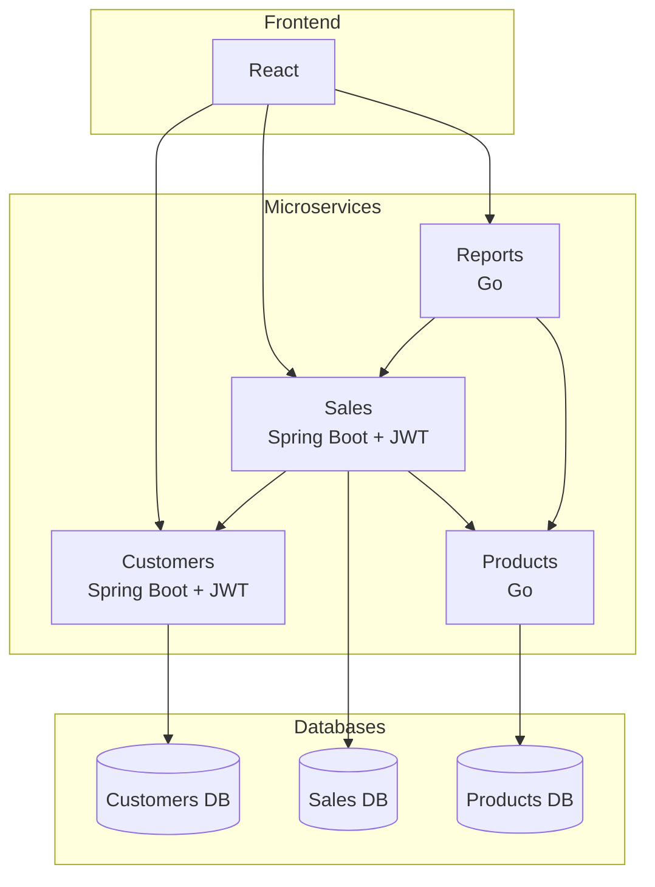

# Individual Contribution to the PDR
## Sales Management System for a Store

**project_key:** PRJ-GESTION-VENTAS-V1
**Member:** Angel Gustavo Solano Trujillo
**Assigned points:** Requirements and Architecture
**Responsibility:** Explain what the system must do and how it will be built.

**Declared technology stack**
- Backend: Java (Spring Boot) + Go
- Database: PostgreSQL
- Frontend: React

---

## 4. Requirements

### 4.1 Functional Requirements

| ID | Description |
|---|---|
| RF-01 | The system must allow registering, updating, searching, and deleting customers. |
| RF-02 | The system must allow registering products with name, price, stock, and category. |
| RF-03 | The system must allow updating product stock. |
| RF-04 | The system must allow creating a sale associating a customer and one or more products. |
| RF-05 | The system must automatically calculate the total for each sale. |
| RF-06 | The system must validate the existence of the customer and product stock availability before confirming a sale. |
| RF-07 | The system must generate daily sales reports. |
| RF-08 | The system must generate monthly sales reports. |
| RF-09 | The system must generate a report of the best-selling products. |
| RF-10 | The system must authenticate users using JWT before allowing operations on business data. |

### 4.2 Non-Functional Requirements

| ID | Description |
|---|---|
| RNF-01 | **Modularity:** each business domain must be implemented as an independent microservice, following a hexagonal architecture. |
| RNF-02 | **Distributed persistence:** each microservice must have its own PostgreSQL database, with no direct access to other services' databases. |
| RNF-03 | **Interoperability:** communication between microservices must be done via REST APIs. |
| RNF-04 | **Security:** sensitive operations must require a valid JWT token. |
| RNF-05 | **Development availability:** each microservice must be deployable and testable independently (Docker containers). |
| RNF-06 | **Conceptual scalability:** the design should, in theory, allow scaling each service independently according to its load. |
| RNF-07 | **Maintainability:** the code should clearly separate domain, use cases, and adapters. |

---

## 5. Architecture Design

### 5.1 Overview

The system is composed of **4 independent microservices**, each with its own PostgreSQL database, communicating with each other via HTTP requests and optionally via asynchronous messaging. All services expose their functionality through **REST APIs**, consumed by a web interface developed in **React**.

Authentication and authorization are managed using **JWT**, required on all routes that involve operations on business data.

### 5.2 Microservices

| Component | Technology | Responsibility |
|---|---|---|
| Frontend | React | User interface, consumption of REST APIs |
| Customers Service | Java (Spring Boot) + JWT | Management of customer data |
| Products/Inventory Service | Go | Management of catalog and stock |
| Sales Service | Java (Spring Boot) + JWT | Sales orchestration, total calculation |
| Reports Service | Go | Analytics and report generation |
| Databases | PostgreSQL (one per service) | Independent persistence per domain |

Each microservice is autonomous: it has its own source code, its own database, and can be deployed independently without sharing schemas or tables with others.

### 5.3 Hexagonal Architecture

Each microservice is designed following the **hexagonal architecture (Ports & Adapters)** pattern, which aims to isolate business logic from external technical details (frameworks, database, communication protocol). It consists of three layers:

- **Domain:** entities and pure business rules, without dependencies on frameworks or external libraries.
- **Application (use cases):** orchestrates business logic and defines **ports** — interfaces that declare what the domain needs (for example, a customer repository) or what it exposes externally.
- **Infrastructure (adapters):** concrete implementations of those ports. Includes:
  - *Inbound adapters:* REST controllers that receive HTTP requests and translate them into calls to use cases.
  - *Outbound adapters:* repositories that implement persistence in PostgreSQL, and HTTP clients that allow one service to consume another (for example, Sales calling Customers).

### 5.4 Communication between services

- **Initial phase (project baseline):** **synchronous communication via REST/HTTP**.
  - *Sales → Customers:* validates the existence of the customer before registering the sale.
  - *Sales → Products:* validates available stock, obtains the product price, and updates stock after confirming the sale.
  - *Reports → Sales:* queries historical sales data to build requested reports.

Since each microservice has its own database, there is no referential integrity at the database level between services (for example, `customer_id` in the `sales` table is not a real foreign key to the Customers database); consistency is ensured through validations performed via inter-service calls.