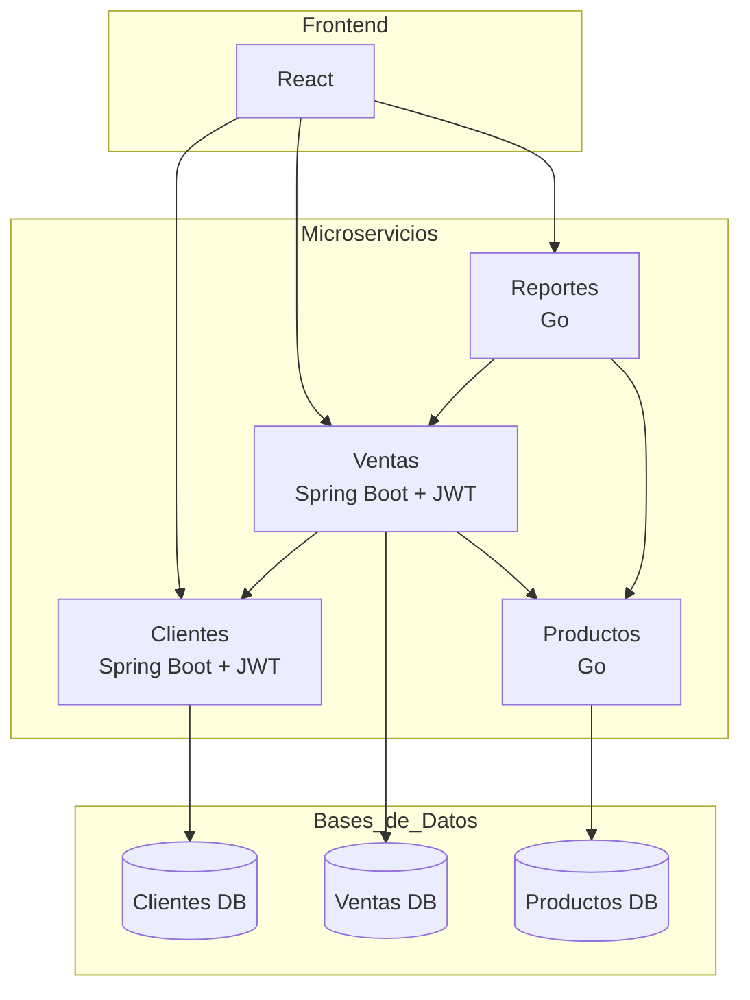

# Aporte Individual al PDR
## Sistema de Gestión de Ventas para una Tienda

**project_key:** PRJ-GESTION-VENTAS-V1
**Integrante:** [Escribe aquí tu nombre]
**Puntos asignados:** Requerimientos y Arquitectura
**Responsabilidad:** Explicar qué debe hacer el sistema y cómo estará construido.

**Stack tecnológico declarado**
- Backend: Java (Spring Boot) + Go
- Base de datos: PostgreSQL
- Frontend: React

---

## 4. Requerimientos

### 4.1 Requerimientos Funcionales

| ID | Descripción |
|---|---|
| RF-01 | El sistema debe permitir registrar, actualizar, buscar y eliminar clientes. |
| RF-02 | El sistema debe permitir registrar productos con nombre, precio, stock y categoría. |
| RF-03 | El sistema debe permitir actualizar el stock de productos. |
| RF-04 | El sistema debe permitir crear una venta asociando un cliente y uno o más productos. |
| RF-05 | El sistema debe calcular automáticamente el total de cada venta. |
| RF-06 | El sistema debe validar la existencia del cliente y la disponibilidad de stock antes de confirmar una venta. |
| RF-07 | El sistema debe generar reportes de ventas por día. |
| RF-08 | El sistema debe generar reportes de ventas por mes. |
| RF-09 | El sistema debe generar un reporte de los productos más vendidos. |
| RF-10 | El sistema debe autenticar usuarios mediante JWT antes de permitir operaciones sobre los datos. |

### 4.2 Requerimientos No Funcionales

| ID | Descripción |
|---|---|
| RNF-01 | **Modularidad:** cada dominio de negocio debe implementarse como un microservicio independiente, siguiendo arquitectura hexagonal. |
| RNF-02 | **Persistencia distribuida:** cada microservicio debe contar con su propia base de datos PostgreSQL, sin acceso directo a bases de datos de otros servicios. |
| RNF-03 | **Interoperabilidad:** la comunicación entre microservicios debe realizarse mediante API REST. |
| RNF-04 | **Seguridad:** las operaciones sensibles deben requerir un token JWT válido. |
| RNF-05 | **Disponibilidad de desarrollo:** cada microservicio debe poder desplegarse y probarse de forma independiente (contenedores Docker). |
| RNF-06 | **Escalabilidad conceptual:** el diseño debe permitir, en teoría, escalar cada servicio de forma independiente según su carga. |
| RNF-07 | **Mantenibilidad:** el código debe separar claramente dominio, casos de uso y adaptadores. |

---

## 5. Diseño de la Arquitectura

### 5.1 Vista general

El sistema se compone de **4 microservicios independientes**, cada uno con su propia base de datos PostgreSQL, comunicándose entre sí mediante peticiones HTTP y, opcionalmente, mediante mensajería asíncrona. Todos los servicios exponen sus funcionalidades mediante **APIs REST**, consumidas por una interfaz web desarrollada en **React**.

La autenticación y autorización se gestiona mediante **JWT**, requerida en todas las rutas que impliquen operaciones sobre datos del negocio.

### 5.2 Microservicios

| Componente | Tecnología | Responsabilidad |
|---|---|---|
| Frontend | React | Interfaz de usuario, consumo de APIs REST |
| Servicio Clientes | Java (Spring Boot) + JWT | Administración de datos de clientes |
| Servicio Productos/Inventario | Go | Administración de catálogo y stock |
| Servicio Ventas | Java (Spring Boot) + JWT | Orquestación de ventas, cálculo de totales |
| Servicio Reportes | Go | Analítica y generación de reportes |
| Bases de datos | PostgreSQL (una por servicio) | Persistencia independiente por dominio |

Cada microservicio es autónomo: posee su propio código fuente, su propia base de datos y puede desplegarse de forma independiente, sin compartir esquemas ni tablas con los demás.

### 5.3 Arquitectura hexagonal

Cada microservicio se diseña siguiendo el patrón **arquitectura hexagonal (Ports & Adapters)**, cuyo objetivo es aislar la lógica de negocio de los detalles técnicos externos (framework, base de datos, protocolo de comunicación). Se compone de tres capas:

- **Dominio:** entidades y reglas de negocio puras, sin dependencias de frameworks ni librerías externas.
- **Aplicación (casos de uso):** orquesta la lógica de negocio y define **puertos** — interfaces que declaran qué necesita el dominio (por ejemplo, un repositorio de clientes) o qué expone hacia afuera.
- **Infraestructura (adaptadores):** implementaciones concretas de esos puertos. Incluye:
  - *Adaptadores de entrada:* controladores REST que reciben peticiones HTTP y las traducen en llamadas a los casos de uso.
  - *Adaptadores de salida:* repositorios que implementan la persistencia en PostgreSQL, y clientes HTTP que permiten a un servicio consumir a otro (por ejemplo, Ventas consultando a Clientes).

### 5.4 Comunicación entre servicios

- **Fase inicial (base del proyecto):** comunicación **síncrona vía REST/HTTP**.
  - *Ventas → Clientes:* valida la existencia del cliente antes de registrar la venta.
  - *Ventas → Productos:* valida el stock disponible, obtiene el precio del producto y actualiza el stock tras confirmar la venta.
  - *Reportes → Ventas:* consulta los datos históricos de ventas para construir los reportes solicitados.

Dado que cada microservicio posee su propia base de datos, no existe integridad referencial a nivel de base de datos entre servicios (por ejemplo, `cliente_id` en la tabla `ventas` no es una llave foránea real hacia la base de datos de Clientes); la consistencia se garantiza mediante validaciones realizadas a través de las llamadas entre servicios.