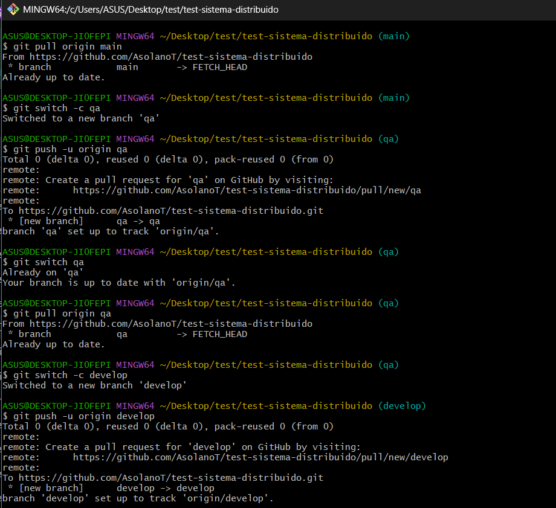
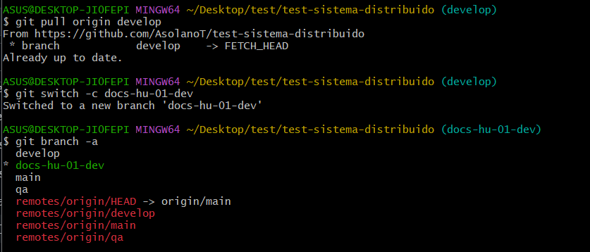
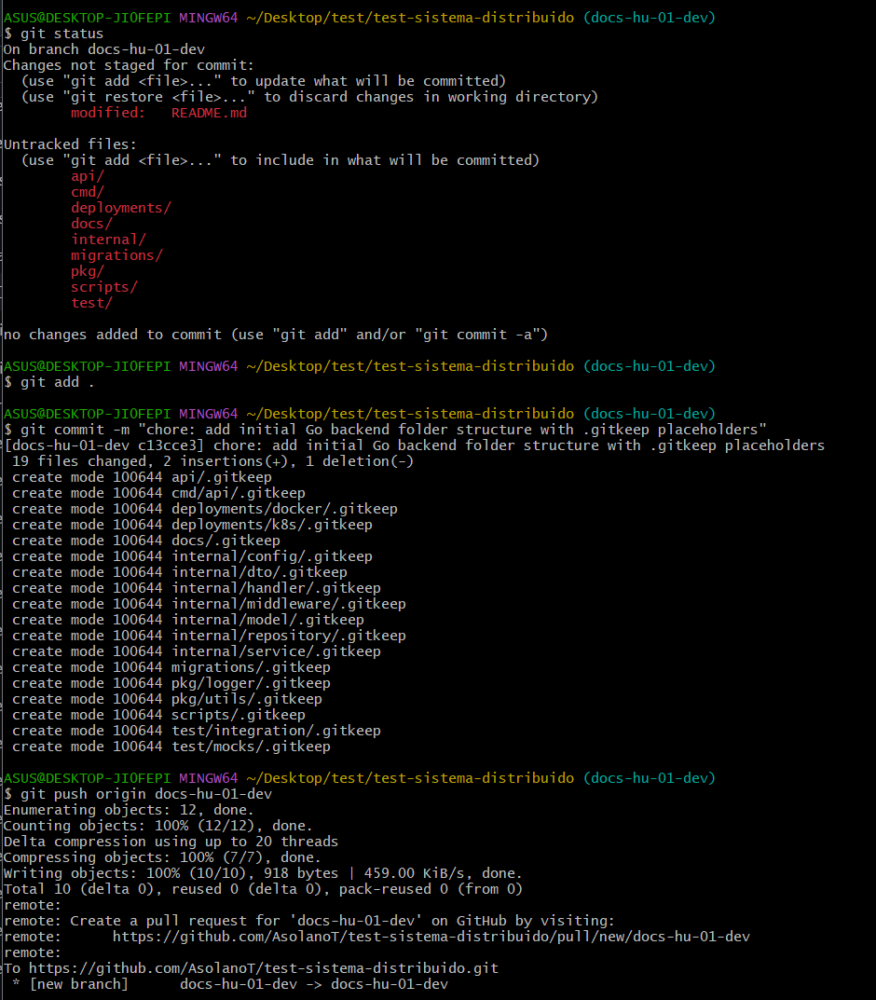
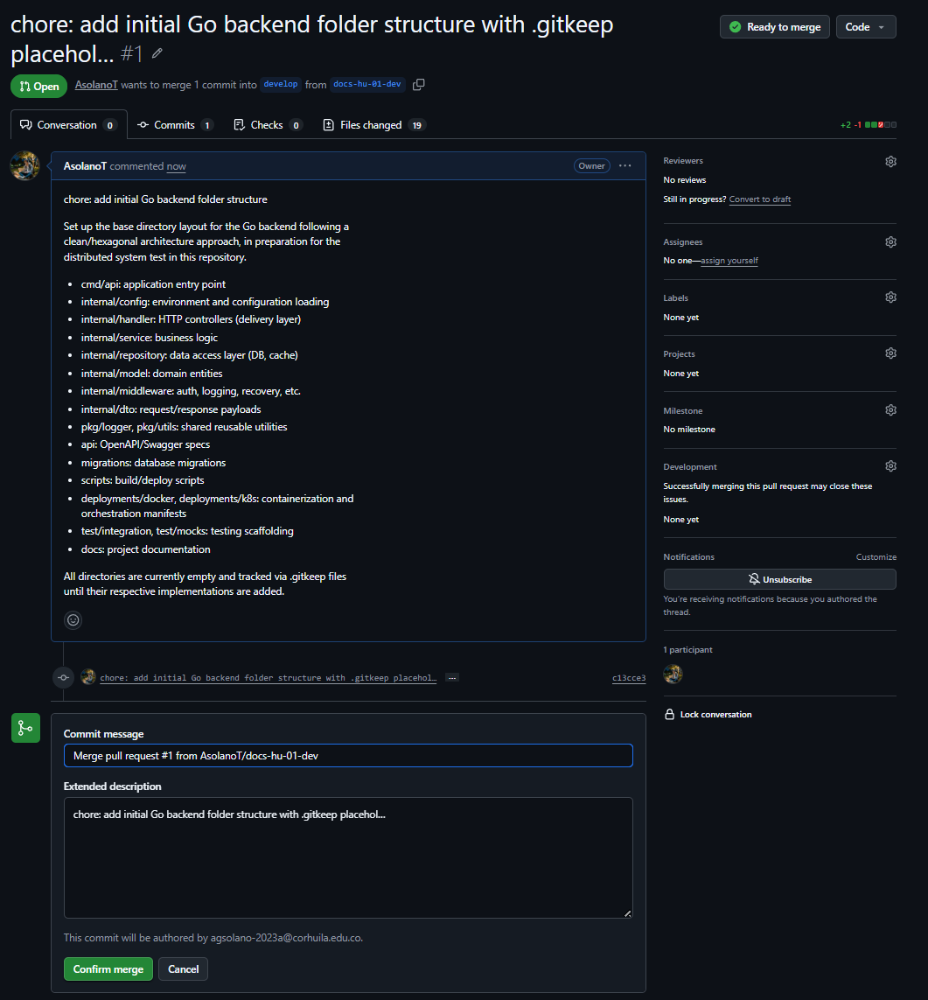
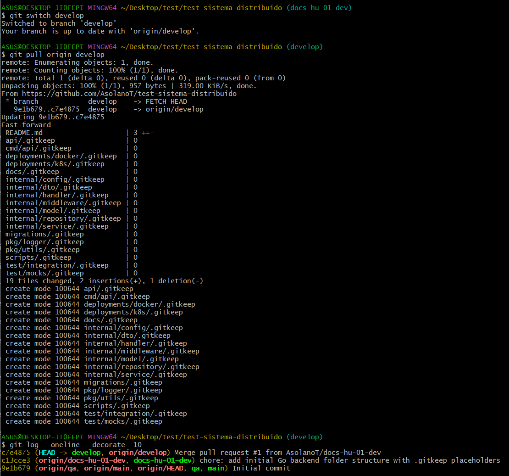
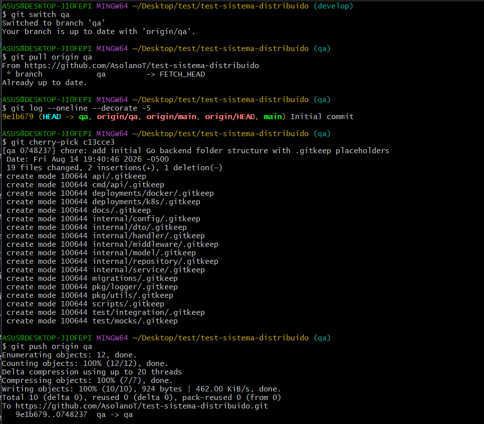
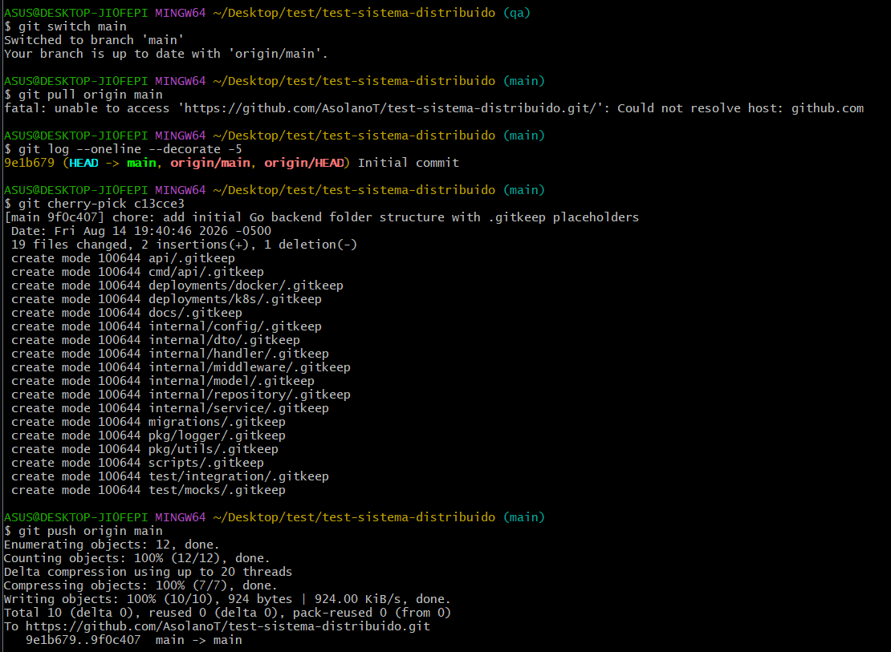

# Cherry-Pick Example 12-08-2026

**Repository:** [test-sistema-distribuido](https://github.com/AsolanoT/test-sistema-distribuido.git)

| Session | Evidence |
|---|---|
| Session 2 | https://github.com/AsolanoT/test-sistema-distribuido.git |

## Objective

Replicate a User Story (US) workflow where a hierarchical branch structure is created (`main` → `qa` → `develop`), a US is developed in a child branch, integrated into `develop` via Pull Request, and finally a specific commit is brought to `qa` and `main` using **cherry-pick**.

## What is Cherry-Pick?

> **Take a specific commit that exists in another branch and apply its changes in the current branch.**

Unlike a `merge`, which brings **all the history** of a branch, `cherry-pick` allows you to select **a specific commit** and replicate it in another branch, without dragging along the rest of the changes.

## Flow Diagram

```
docs-hu-01-dev
       │
       │ Pull Request + Merge
       ↓
    develop
       │
       │ cherry-pick c13cce3
       ↓
      qa
       │
       │ cherry-pick c13cce3
       ↓
     main
```

---

## Step 1 — Creation of Base Branches (`main` → `qa` → `develop`)

Starting from the `main` branch, `qa` is created, and from `qa`, `develop` is created.

```bash
git status
git switch main
git pull origin main
git switch -c qa
git push -u origin qa
git switch qa
git pull origin qa
git switch -c develop
git push -u origin develop
```


---

## Step 2 — Creation of the US Child Branch (`docs-hu-01-dev`)

From `develop`, the specific working branch for User Story HU-01 is created. `docs-hu-01-dev` is created as an isolated working branch, and all branches are listed to confirm the new branch exists.

```bash
git switch develop
git pull origin develop
git switch -c docs-hu-01-dev
git branch -a
```



---

## Step 3 — Uploading the Backend Structure in `docs-hu-01-dev`

The Go backend folder structure (with `.gitkeep` files) is added and pushed to the US branch.

```bash
git status
git add .
git commit -m "chore: add initial Go backend folder structure with .gitkeep placeholders"
git push origin docs-hu-01-dev
```

**Explanation:** pending changes are reviewed (`git status`), all new files (backend folder structure) are staged, the commit is recorded with a conventional commit message, and the `docs-hu-01-dev` branch is pushed to GitHub. The resulting commit has the hash **`c13cce3`**, which will be used later in the cherry-picks.



---

## Step 4 — Pull Request `docs-hu-01-dev` → `develop` (GitHub)

The Pull Request from the US branch to `develop` is created and merged. This integrates the complete HU-01 work into the `develop` integration branch, where the progress of all US branches in development coexists.

**Path:** `docs-hu-01-dev → develop`



---

## Step 5 — Merge Verification in `develop`

The local `develop` branch is updated and it's confirmed that the Pull Request merge was applied correctly.

```bash
git switch develop
git pull origin develop
git log --oneline --decorate -10
```

**Explanation:** `git log` confirms that `develop` now contains commit **`c13cce3`** (backend structure) in addition to the repository's initial commit.



---

## Step 6 — Cherry-picking the Commit into `qa`

Instead of merging the entire `develop` branch, only the specific backend structure commit (`c13cce3`) is taken and applied onto `qa`.

```bash
git switch qa
git pull origin qa
git cherry-pick c13cce3
git push origin qa
```

**Explanation:** it's confirmed that `qa` only has the initial commit (`9e1b679`). With `git cherry-pick c13cce3`, the backend structure commit is exactly replicated onto `qa`, generating a new equivalent commit on this branch.



---

## Step 7 — Cherry-picking the Commit into `main`

The same procedure is repeated, this time applying the commit onto the `main` branch. The cherry-pick of commit **`c13cce3`** is applied onto `main` and the change is published with `git push origin main`, completing the propagation of the commit across the three main branches.

```bash
git switch main
git pull origin main
git cherry-pick c13cce3
git push origin main
```



---

## Complete Flow Summary

| Step | Action | Source Branch | Target Branch | Method |
|---|---|---|---|---|
| 1 | Creation of base branches | `main` | `qa`, `develop` | `switch -c` + `push` |
| 2 | Creation of the US branch | `develop` | `docs-hu-01-dev` | `switch -c` |
| 3 | Backend structure commit | — | `docs-hu-01-dev` | `add` + `commit` + `push` |
| 4 | US integration | `docs-hu-01-dev` | `develop` | Pull Request (GitHub) |
| 5 | Local verification | — | `develop` | `pull` + `log` |
| 6 | Commit propagation | `develop`/specific commit | `qa` | `cherry-pick` |
| 7 | Commit propagation | `qa`/specific commit | `main` | `cherry-pick` |
