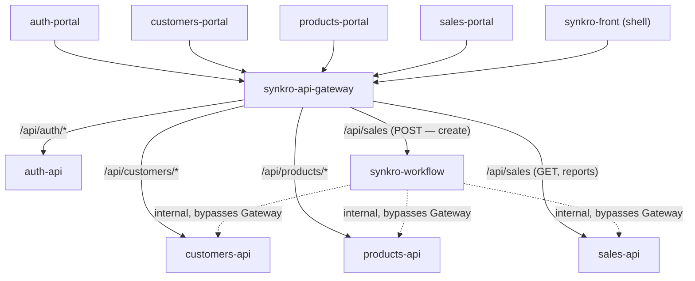
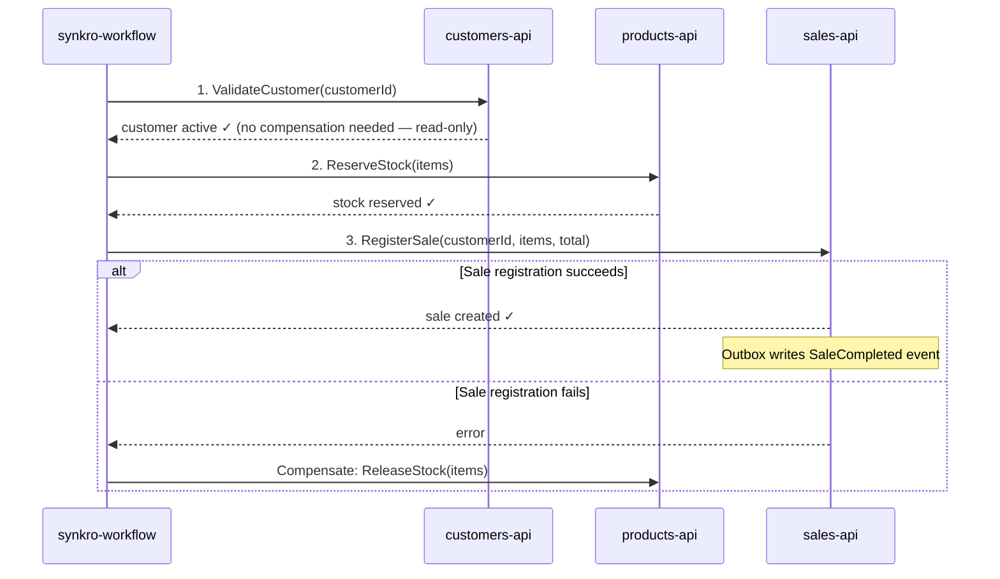

# ADR-003 — API Gateway, Saga Workflow, and Async Messaging Adoption

| Field | Value |
|-------|-------|
| **ID** | ADR-003 |
| **Date** | 2026-09 |
| **Status** | Accepted |
| **Authors** | Angel Gustavo Solano Trujillo — Tech Lead, Sergio Andrés Ordóñez Díaz |
| **Reviewers** | Jordan Ramirez Gallego, Fredman Santiago Plazas Artunduaga — Development team |
| **Modifies** | ADR-001 §5 (Communication Between Services), §6 (Auth, JWT, and Roles); `05-architecture/pattern-guide.md` §1 (Saga), §3 (Outbox) |

---

## Context

This week the professor created 4 new repositories that expand the course scope beyond the 4 domain microservices already decided in ADR-001: `synkro-api-gateway`, `synkro-worker`, `synkro-workflow`, and `synkro-front`. Per the professor's descriptions:

- **`synkro-api-gateway`:** single entry point for the system — token validation, routing, rate limiting, CORS. "No client should call a domain service directly."
- **`synkro-workflow`:** business process orchestration across multiple domains, implementing the Saga pattern — the sequence of steps and what gets undone if a step fails. "A process that lives only within one domain does not go here — it goes in that domain's API."
- **`synkro-worker`:** asynchronous background processing — everything that happens without anyone asking for it (scheduled notifications, recalculations, emails). Exposes no HTTP; consumes events from a queue.
- **`synkro-front`:** frontend shell that packages the 4 domain UIs.

These repositories invalidate three decisions that ADR-001 and `pattern-guide.md` had already made:

1. **ADR-001 §6** assumes each of the 4 services validates the JWT locally, with no synchronous call to Auth. With a Gateway as the single entry point, that validation can be centralized.
2. **`pattern-guide.md` §1 explicitly rejected the Saga pattern**, arguing that "the MVP does not have the infrastructure" (message broker, saga state machine). That infrastructure now exists.
3. **`pattern-guide.md` §3 rejected Outbox** for the same reason — no broker, no domain events to publish.
4. **`05-architecture/overview.md` Principle P3** states "there is no API Gateway — direct frontend-to-service communication", which is no longer true.

Additionally, the sale-registration flow already documented in `pattern-guide.md` §6 — 3 domains (Sales, Customers, Products), multi-step sequence, explicit compensation if stock deduction fails mid-way — is exactly the type of process the professor describes as belonging in `synkro-workflow`.

This ADR **does not reopen** ADR-001 (it remains unaltered per its own immutability rule); it extends the architecture to incorporate the 4 new repositories.

---

## Decision 1 — API Gateway

### Evaluated Alternatives

**Alternative A — Adopt the Gateway as the single entry point (CHOSEN).** All external traffic (the 4 domain frontends + the `synkro-front` shell) goes through `synkro-api-gateway`, which routes to the corresponding domain service based on the path.

- **Pros:** Fulfills the professor's explicit rule ("no client should call a domain service directly"). Centralizes CORS, rate limiting, and access logging in one place instead of 4 duplicated configurations.
- **Cons:** Introduces a new single point of failure — if the Gateway goes down, the entire system is unreachable from the outside even though the 4 domain services are still running. Adds an extra network hop to every request.

**Alternative B — Keep direct frontend-to-service communication (ADR-001 status quo), rejected.** The professor already provided the Gateway repository as part of the course scope; maintaining the previous model directly contradicts his explicit instruction.

### Decision

**Alternative A** is adopted. `synkro-api-gateway` is the only external entry point to the system. No frontend calls a domain service directly.

**Gateway scope (North-South traffic, not East-West):** the Gateway governs traffic entering from the outside (frontends → system). Internal backend-to-backend calls (e.g., `synkro-workflow` calling `customers-api`) **do not pass through the Gateway** — they are internal traffic between trusted services, not "external clients" in the sense of the professor's rule.



**Explicit decision on who receives `POST /api/sales`:** the Gateway routes sale-creation writes to `synkro-workflow`, not to `sales-api`. Justification: creating a sale is no longer a single-domain operation — it touches Customers, Products, and Sales, and requires compensation if a step fails mid-way. `sales-api` keeps the operations that are genuinely single-domain: `GET /api/sales/{id}`, reports (`FR-008`, `FR-009`). This is consistent with the professor's rule: "a process that lives only within one domain does not go here [to `workflow`] — it goes in that domain's API."

---

## Decision 2 — JWT Validation

### Evaluated Alternatives

**Alternative A — The Gateway validates the JWT and forwards a trusted header (CHOSEN).** The Gateway verifies the RS256 signature once, extracts `sub`, `roles`, `permissions`, and forwards them to domain services as internal headers (`X-User-Id`, `X-User-Roles`). Domain services trust those headers without re-validating the JWT.

- **Pros:** Eliminates 4 duplicated validation configurations. Is the natural responsibility of a Gateway ("everything from outside enters here: token validation").
- **Cons:** If a domain service is exposed to the network without passing through the Gateway (network/firewall misconfiguration), it accepts any forged header as valid, with no way to detect it on its own.

**Alternative B — Keep local validation in each service (ADR-001 §6, defense in depth), rejected for this iteration.**

- **Pros:** No domain service blindly trusts a header — it is secure even if the network is misconfigured.
- **Cons:** Duplicates the validation logic the Gateway already performs. Contradicts the simplification the Gateway's own role is meant to provide.

### Decision

**Alternative A** is adopted. The accepted risk is declared explicitly: **this model is secure only if the network guarantees that no domain service is reachable without passing through the Gateway first** (e.g., via a Docker internal network where domain service ports are not exposed to the host, or firewall rules that only allow inbound traffic from the Gateway). This network guarantee must be documented in `05-architecture/deployment.md` as part of HU-ARQ-14 downstream work.

---

## Decision 3 — Message Broker (RabbitMQ)

### Decision

**RabbitMQ** is formally adopted — it stops being a "future candidate" (mentioned in ADR-001 §5, `scope.md`, and `pattern-guide.md` without ever being adopted) and becomes part of the active architecture.

**Justification:**
- It is the only broker this repository has mentioned across 3 separate documents — adopting it does not reopen any decision, it formalizes what was already noted.
- Mature bindings in both project languages: `amqp091-go` (Go) and `spring-amqp` (Java).
- The expected message volume (notifications, emails, scheduled recalculations) is the exact use case for a simple work queue — it does not justify the operational complexity of Kafka, designed for high-throughput streaming.

**RabbitMQ's role in the architecture:** connects publishers (`sales-api` via its Outbox relay, see Decision 5) with `synkro-worker` as the asynchronous job consumer (confirmation emails, `sales_summary` recalculation, scheduled notifications).

---

## Decision 4 — Saga Orchestration: Sale Registration

### Evaluated Alternatives

**Alternative A — Move sale registration to an orchestrated Saga in `synkro-workflow` (CHOSEN).**

**Alternative B — Keep the inline orchestration inside `sales-service`, as currently documented in `pattern-guide.md` §6, rejected.** No longer consistent with the professor's rule: a 3-domain process with explicit compensation is exactly the example he himself gives as a `workflow` candidate (the loan that reserves, validates, registers, schedules).

### Decision

**Alternative A** is adopted. The Saga is called `SaleRegistrationSaga`, orchestrated by `synkro-workflow`, with 3 synchronous steps (direct REST calls to each domain API, without passing through the Gateway):



**Step order change from the previous design:** in `pattern-guide.md` §6, the order was to create the sale first and deduct stock afterward. In the Saga, this is inverted: **reserve stock first, register the sale afterward.** Reason: if stock is unavailable, the step fails before writing any sale record — there is nothing to compensate in `sales-api`. This reduces the compensation surface from 2 possible reversals to 1.

**`synkro-workflow` does not persist any state of its own.** It is a stateless orchestrator: it executes its 3 steps as synchronous REST calls within a single HTTP request, and handles compensation in memory during that same request. There is no "long-running saga" that survives a restart — the entire operation (success or failure) completes in milliseconds, within a single request/response cycle. If `workflow` crashes mid-way through the 3 steps, the salesperson sees a network error and retries, just like any other API failure.

**Confirmation of this decision:** the professor did not create a `synkro-workflow-db`, `synkro-worker-db`, or `synkro-api-gateway-db` repository — only the 4 domain services have their own database repository. This confirms that `workflow`, `worker`, and `gateway` are designed as services without their own database.

---

## Decision 5 — Outbox Pattern

### Evaluated Alternatives

**Alternative A — Outbox inside a new schema owned by `synkro-workflow`, rejected.** Would require `workflow` to stop being a stateless orchestrator and obtain its own schema, database user, and repository — contradicting Decision 4 (`workflow` persists nothing) and the professor's own signal (no `synkro-workflow-db` was created).

**Alternative B — Outbox inside the `sales` schema, which already exists (CHOSEN).** The only durable write that truly matters to notify about is the sale creation — and that write already happens in `sales-api`, owner of its own schema since ADR-001.

### Decision

**Alternative B** is adopted. When `sales-api` registers the sale (step 3 of the Saga), it writes the `sales` row **and** a row in `sales.outbox`, in the same local transaction — no new schema or repository needed. A separate relay process reads `sales.outbox` and publishes to RabbitMQ.

**Why this still solves the real problem:** if `sales-api` crashes right after writing the sale but before the relay publishes to RabbitMQ, the event remains in `sales.outbox` — it is not lost, and the relay publishes it as soon as the service is available again. This is the same guarantee we were looking for, without inventing infrastructure the professor himself did not include in his repository design.

```sql
-- In the sales schema, already existing (schema owner: sales_user)
CREATE TABLE sales.outbox (
  id           UUID PRIMARY KEY DEFAULT gen_random_uuid(),
  event_type   VARCHAR(100) NOT NULL,   -- 'SaleCompleted' | 'SaleFailed'
  payload      JSONB NOT NULL,
  created_at   TIMESTAMPTZ DEFAULT NOW(),
  published_at TIMESTAMPTZ,
  published    BOOLEAN DEFAULT false
);
```

**Note on the compensation step (`ReleaseStock` in `products-api`):** that step does not need Outbox — it happens within the same synchronous request from `workflow`, and does not depend on an external consumer reliably learning about it afterward. Outbox only protects the *final* event that another service (`worker`) needs to receive reliably, not each intermediate Saga step.

---

## Decision 6 — Updated Service Catalog

3 services are added to the catalog (`09-microservices/service-catalog.md`, downstream update from this HU):

| # | Service | Responsibility | Type | Exposes HTTP |
|---|---|---|---|---|
| 05 | `api-gateway` | Single entry point: auth, routing, rate limiting, CORS | Infrastructure | Yes — it is the only external door |
| 06 | `workflow` | Saga orchestration of multi-domain processes (sale registration) | Orchestrator | Yes — its own endpoint to initiate sagas |
| 07 | `worker` | Asynchronous background jobs, RabbitMQ consumer | Background | No — no HTTP, consumes events only |

`synkro-front` is not added to this catalog — it is a frontend shell, not a backend service; its documentation belongs in `12-ux-ui/`, outside the scope of this ADR.

---

## Consequences

**Positive:**
- The system fulfills the professor's explicit rule: no client calls a domain service directly.
- The sale-registration Saga has explicit compensation and reduces its own reversal surface by reordering the steps.
- Outbox closes the "lost event" case before the first Saga implementation is born with that known defect.
- RabbitMQ is no longer an unresolved mention across 3 separate documents.

**Negative:**
- The Gateway is a new single point of failure — if it goes down, the system is unreachable from the outside even though the 4 domain services are still running.
- JWT validation via forwarded header depends on a network guarantee that must be actively maintained (see Decision 2) — a network misconfiguration breaks it silently.
- `synkro-workflow` and `synkro-worker` are two new services with their own operational complexity (orchestration, queue consumption) that did not exist before this week — though, being both stateless, that complexity is limited to application logic, with no additional database infrastructure.

**Mitigation:**
- The Gateway's single point of failure is accepted as a risk within the academic scope — high availability (replicas, load balancer) is not justified for this project.
- Decision 2's network guarantee is documented as an explicit requirement in `deployment.md`, not as an implicit assumption.

---

## Affected Documents

| Document | Required Change |
|----------|----------------|
| `05-architecture/overview.md` | Principle P3 corrected (no longer "no Gateway"); "does NOT have" table updated; C4 Level 2 diagram updated with Gateway/Workflow/Worker |
| `05-architecture/pattern-guide.md` | Saga and Outbox sections re-evaluated from "Rejected" to "Adopted", referencing this ADR |
| `09-microservices/service-catalog.md` | Add the 3 rows from Decision 6 |
| `05-architecture/deployment.md` | Document the network guarantee from Decision 2; add RabbitMQ to docker-compose. **No schema changes** — `workflow` has no database of its own |
| `06-data/models.md` | Add `outbox` table **inside the already-existing `sales` schema** (not a new schema) |
| ADR-001 | **No changes** — immutable per its own rule |

---

## Immutability Rule

Once this ADR has been accepted, **it must not be modified**. Any change to this architectural decision must be documented in a new file (`ADR-004-*.md`) that explicitly references ADR-003 as the decision being replaced.

---

## References

* Original architecture decision → `05-architecture/decisions/records/ADR-001-architecture.md`
* Sale authorship traceability → `05-architecture/decisions/records/ADR-002-sale-authorship-traceability.md`
* Distributed pattern evaluation (earlier version, now partially reversed) → `05-architecture/pattern-guide.md`
* Service catalog → `09-microservices/service-catalog.md`
* Domain events (to be completed in HU-DOCS-29, depends on this ADR) → `02-domain/domain-events.md`
