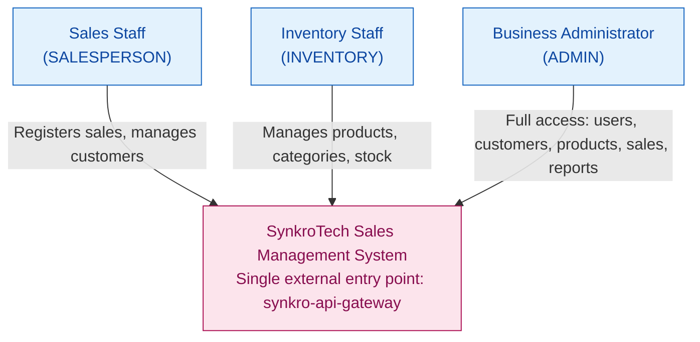
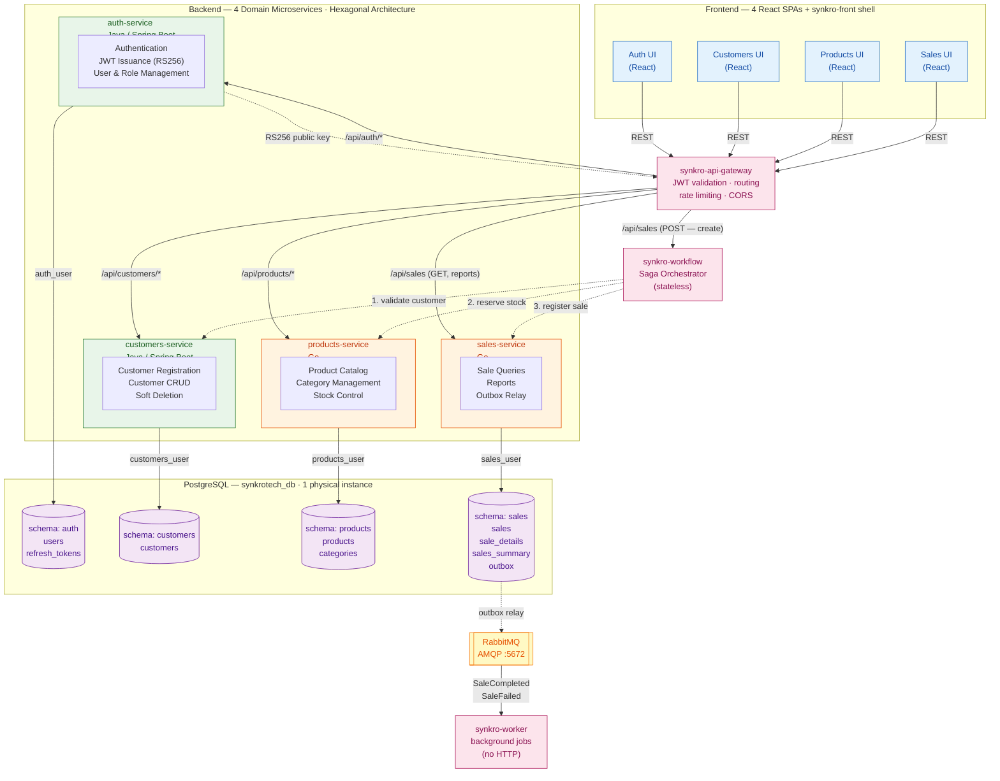

# System Architecture Overview

> Technical snapshot of the SynkroTech SAS Sales Management System.
> Every statement in this document is traceable to
> [`ADR-001-architecture.md`](decisions/records/ADR-001-architecture.md)
> or to [`service-catalog.md`](../09-microservices/service-catalog.md).

---

## 1. Adopted Architectural Style

**Style:** Independent microservices with Hexagonal Architecture (Ports and Adapters), one per bounded context, communicating through synchronous REST/HTTP.

**Justification:** The Distributed Systems course requires 4 backend repositories in two languages (Java, Go), 4 frontend repositories, 1 shared database repository, and 1 documentation repository. The bounded context analysis identified 4 business contexts with low coupling — Authentication, Customers, Products and Inventory, Sales — making a 1:1 mapping between bounded contexts and microservices natural rather than forced.

**Reference ADR:** [`ADR-001-architecture.md`](decisions/records/ADR-001-architecture.md)

---

## 2. C4 Diagram — Level 1: System Context

Shows how the SynkroTech Sales Management System fits in its environment: who uses it and what external systems it depends on.



At this level, the diagram intentionally does not show the Gateway, the
4 domain services, or `synkro-workflow`/`synkro-worker` — Level 1 only
shows that the system has a single point of contact for its users.
The internal breakdown belongs to Level 2 (§3 below).

**External integrations:** none. The system is self-contained and does not depend on external providers in this version (see `01-context/scope.md` → External Integrations).

**Also available in draw.io:** this diagram is also maintained as
`08-uml/diagrams/source/c4-01-context.drawio`, added for visual quality
(see `08-uml/diagram-index.md` for why both versions exist). **Update
both in the same PR** when this diagram changes — this Mermaid version
is the original and stays authoritative, but the draw.io copy must not
be allowed to drift from it.

---

## 3. C4 Diagram — Level 2: Containers

Shows the processes, databases, and communication channels within the system.



**Also available in draw.io:** this diagram is also maintained as
`08-uml/diagrams/source/c4-02-containers.drawio`, added for visual
quality (see `08-uml/diagram-index.md` for why both versions exist).
**Update both in the same PR** when this diagram changes — this Mermaid
version is the original and stays authoritative, but the draw.io copy
must not be allowed to drift from it.

---

## 4. Service Catalog (Summary)

| # | Service | Responsibility | Port | Technology | Schema | Communication |
|---|---------|---------------|------|------------|--------|---------------|
| 1 | auth-service | User registration/login, JWT (RS256) issuance, role management | 8081 | Java (Spring Boot) | `auth` | REST via Gateway. Public key consumed by the Gateway (ADR-003 §2) |
| 2 | customers-service | Customer CRUD with soft deletion | 8082 | Java (Spring Boot) | `customers` | REST via Gateway. Called internally by `synkro-workflow` (Saga step 1) |
| 3 | products-service | Product catalog, categories, stock control | 8083 | Go | `products` | REST via Gateway. Called internally by `synkro-workflow` (Saga step 2 + compensation) |
| 4 | sales-service | Sale queries, reports, Outbox relay | 8084 | Go | `sales` | REST via Gateway (reads/reports). Called internally by `synkro-workflow` (Saga step 3) |
| 5 | api-gateway | Single entry point: JWT validation, routing, rate limiting, CORS | — | — | — | Receives all external traffic; forwards `X-User-Id`/`X-User-Roles` headers |
| 6 | workflow | Saga orchestration of multi-domain processes (sale registration) | — | — | — | REST. Calls customers-api, products-api, sales-api internally (bypasses Gateway) |
| 7 | worker | Asynchronous background jobs: emails, recalculations, scheduled tasks | — | — | — | No HTTP. Consumes events from RabbitMQ |

Full detail per service → `09-microservices/service-catalog.md`

---

## 5. Architectural Principles

These principles guide the project's technical decisions. They are derived from ADR-001 and the course constraints, not from a generic checklist.

### P1: One Service per Bounded Context

Each microservice maps to exactly one bounded context identified in `02-domain/domain-map.md`. A service that cannot justify its existence as a distinct business context must not exist as a separate repository. This is why Reports lives inside Sales (same bounded context) rather than as a fifth service.

### P2: Schema Isolation, Not Database per Service

The system uses a single physical PostgreSQL instance with one schema per service, isolated through dedicated database users and `GRANT` restrictions. No service has read or write access to another service's schema. Cross-schema references (e.g., `customer_id` in sales) are validated through HTTP calls, not foreign keys. The full isolation mechanism is documented in ADR-001 §2.

### P3: API Gateway as the Single External Entry Point

All external traffic enters through `synkro-api-gateway`, which handles JWT validation, routing, rate limiting, and CORS. No frontend calls a domain service directly — this fulfills the course rule that the Gateway is the only external door. Internal backend-to-backend traffic (e.g., `synkro-workflow` calling domain APIs) bypasses the Gateway, as it is trusted East-West traffic, not an external client. 

The Gateway validates the JWT once and forwards trusted headers (`X-User-Id`, `X-User-Roles`) to domain services, which no longer validate the token themselves. This is secure only if the network guarantees that no domain service is reachable without passing through the Gateway first — see `deployment.md` for the Docker network configuration that enforces this. Decision documented in ADR-003 §2.

### P4: Contract-First API Design

API contracts (OpenAPI) are designed before the service is implemented. The contract is the source of truth for frontend developers and for service-to-service communication. Contracts live in `07-api/contracts/openapi/`.

### P5: Soft Deletion as the Only Deletion Strategy

No record is ever physically deleted. All entities use an `active` boolean field for deactivation. This preserves operational traceability (NFR-009) and ensures referential integrity across services that hold external references by ID.

---

## 6. Adopted Architectural Patterns

| Pattern | Status | Reference |
|---------|--------|-----------|
| Hexagonal Architecture (Ports and Adapters) | Adopted — mandatory for all 4 services | `05-architecture/hexagonal-architecture.md` |
| Synchronous REST Communication | Adopted — all service-to-service calls in the MVP | ADR-001 §5 |
| Schema-per-Service with GRANT Isolation | Adopted — single PostgreSQL instance | ADR-001 §2 |
| JWT (RS256), Validated at the Gateway | Adopted — centralized validation, trusted headers forwarded to domain services | ADR-003 §2 (supersedes ADR-001 §6) |
| CQRS | Under evaluation | `05-architecture/pattern-guide.md` |
| Event Sourcing | Not adopted | Not evaluated — outside MVP scope |
| API Gateway | Adopted — single external entry point (ADR-003 §1) | `05-architecture/decisions/records/ADR-003-gateway-saga-async.md` |
| Circuit Breaker | Adopted — simplified | `05-architecture/pattern-guide.md` |
| Saga | Adopted — sale registration orchestrated by `synkro-workflow` (ADR-003 §4) | `05-architecture/pattern-guide.md` |
| Outbox Pattern | Adopted — in `sales` schema (ADR-003 §5) | `05-architecture/pattern-guide.md` |
| Event-Driven / Message Broker | Adopted — RabbitMQ (ADR-003 §3) | `05-architecture/pattern-guide.md` |

---

## 7. Communication Patterns

### Synchronous (REST/HTTP)

Synchronous REST/HTTP remains the default within a single Saga step and for all direct frontend-facing reads. The critical multi-domain write path is now orchestrated, not chained inside `sales-service`:

**Sale creation flow (orchestrated by `synkro-workflow`, ADR-003 §4):**

```
synkro-workflow                customers-service          products-service          sales-service
     │                                │                          │                        │
     │── GET /api/customers/{id} ────>│                          │                        │
     │<──── 200 OK (active) ──────────│                          │                        │
     │                                                           │                        │
     │── PATCH /api/products/{id}/stock (reserve) ──────────────>│                        │
     │<──── 200 OK (stock reserved) ─────────────────────────────│                        │
     │                                                                                    │
     │── POST /api/sales (register) ────────────────────────────────────────────────────>│
     │<──── 201 Created (sale + outbox row written, same transaction) ────────────────────│
     │                                                                                    │
     │  [if step 2 or 3 fails: PATCH /api/products/{id}/stock (release) — compensation]   │
```

**JWT validation (every authenticated request):**

The API Gateway validates the JWT once, using Auth's RS256 public key, and forwards trusted headers (`X-User-Id`, `X-User-Roles`) to the target service. Domain services no longer validate the JWT themselves — this is secure only if the network guarantees no domain service is reachable without passing through the Gateway first (ADR-003 §2, `deployment.md`).

### Asynchronous

Adopted (ADR-003 §3). RabbitMQ carries the final Saga outcome from `sales-service`'s Outbox (`SaleCompleted` / `SaleFailed`) to `synkro-worker`, which performs background jobs (confirmation emails, `sales_summary` recalculation, scheduled reports). No other interaction in the system is asynchronous — the Saga's own steps are synchronous REST calls, per ADR-003 §4.

---

## 8. What This Architecture Intentionally Does NOT Have

The template for this document includes several patterns that this project evaluated and deliberately excluded. Listing them here prevents future confusion:

| Absent Element | Why |
|----------------|-----|
| Message Broker (Kafka) | RabbitMQ is adopted (ADR-003 §3); Kafka is not justified at this project's message volume |
| Database per Service (separate instances) | ADR-001 Alternative B — rejected; see ADR-001 §Evaluated Alternatives |
| Redis | No caching layer in the MVP; session state lives in the JWT |
| Distributed Tracing (Jaeger, Zipkin) | Outside MVP scope; correlation IDs are adopted as a lightweight alternative (see `cross-cutting.md`) |
| Prometheus / Grafana | Outside MVP scope; health checks cover basic observability |

---

## 9. Architectural Technical Debt

| ID | Description | Impact | Priority | Reference |
|----|-------------|--------|----------|-----------|
| AT-001 | Sales-service concentrates orchestration of Customers + Products and report generation | High — single point of complex logic | P2 | ADR-001 Consequences (Negative) |
| AT-002 | Single PostgreSQL instance is a single point of failure | Medium — all 4 services go down together | P3 | ADR-001 Consequences (Negative) |
| AT-003 | ~~No async fallback if Products is unavailable during sale creation~~ — **Resolved by ADR-003**: the Saga now compensates (releases stock) synchronously on failure, and RabbitMQ + Outbox guarantee the final outcome is not lost | Closed | — | ADR-003 §4, §5 |

---

## 10. Planned Evolution

| Version | Change | Motivation | Trigger |
|---------|--------|------------|---------|
| Post-MVP | Distributed tracing (OpenTelemetry) | Full observability beyond health checks | Production-like deployment |
| Post-MVP | Multiple branches / warehouses | Business growth | PO decision (currently "Future Candidate" in scope) |

---

## Key Correlations

| This document is fed by... | And feeds... |
|---------------------------|-------------|
| `02-domain/domain-map.md` → bounded contexts | `09-microservices/` → one service per context |
| `04-requirements/non-functional.md` → NFRs | Decisions about resilience and quality |
| ADR-001 → architectural decision | All implementation work |
| `cross-cutting.md` → transversal standards | Consistency across 4 services in 2 languages |
| This overview | `05-architecture/deployment.md` → how it runs |

---

## References

* Architecture decision → `05-architecture/decisions/records/ADR-001-architecture.md`
* Hexagonal architecture guide → `05-architecture/hexagonal-architecture.md`
* Distributed pattern evaluation → `05-architecture/pattern-guide.md`
* Cross-cutting concerns → `05-architecture/cross-cutting.md`
* Deployment topology → `05-architecture/deployment.md`
* Security threat model → `05-architecture/security-threat-model.md`
* Full service catalog → `09-microservices/service-catalog.md`
* Domain bounded contexts → `02-domain/domain-map.md`
* MVP scope → `01-context/scope.md`
