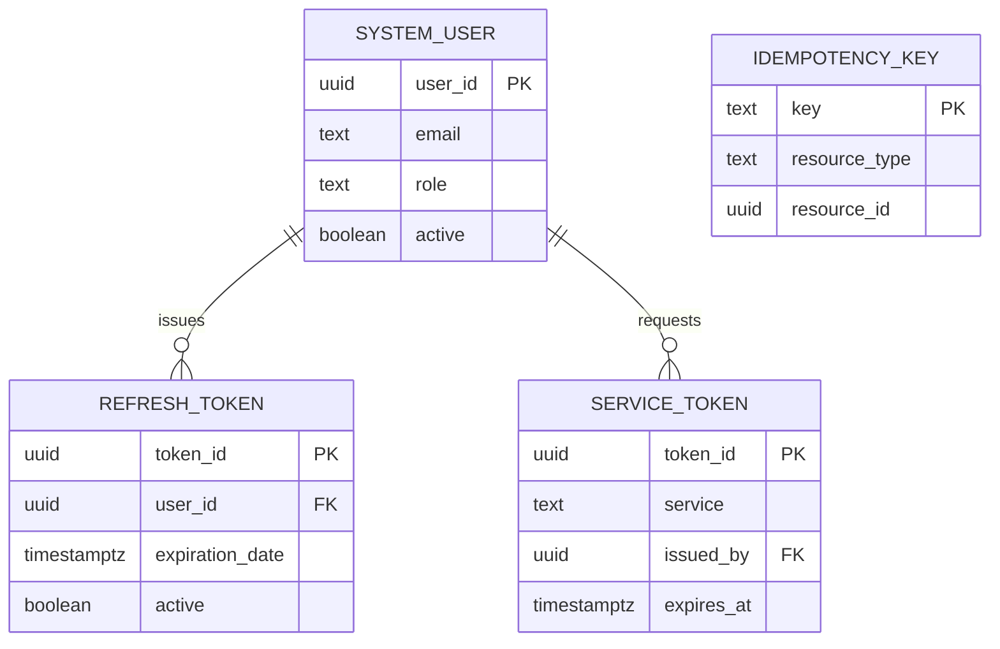
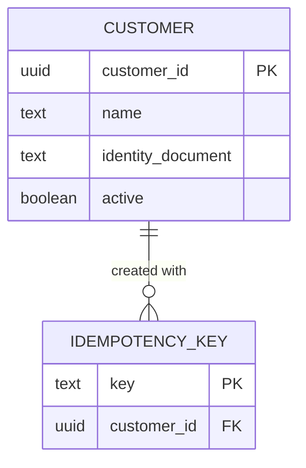
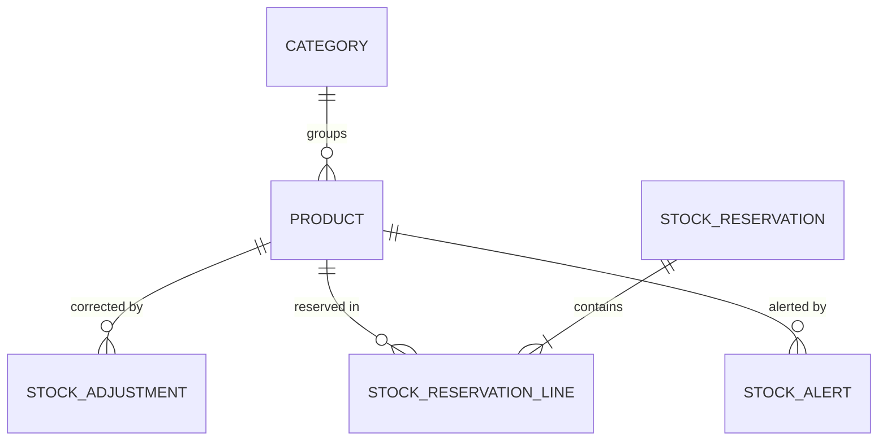

# Data Models per Domain

> The data model of each domain. All domains share **one PostgreSQL
> instance per environment**, defined and started by `synkro-infra`;
> each domain has its own schema (`<domain>_schema`), migrated by its
> `synkro-<domain>-db` repository. No service connects to another
> domain's schema (ADR-009, ADR-005 Decisions 2–5).
>
> The field list comes from ADR-001 §7; ADR-005 changed the table names,
> the money types and the constraint conventions. This document gives the
> DDL each `-db` repository implements.

---

## Data modeling principles

### 1. Schema per domain (mandatory)
A service reads and writes only its own schema in the shared instance. Data from another domain is requested through that domain's API, never with SQL — not even within the same PostgreSQL instance.

```
✓ synkro-sales-api → sales_schema (shared instance, own credentials)
✓ sales portal     → GET /api/v1/customers/{id} → synkro-customers-api → customers_schema
✗ synkro-sales-api → any query against customers_schema (same instance, but no GRANT)
```

### 2. Audit field: `active`, not `deleted_at`
Soft delete uses a boolean `active` field on every table whose rows can be
deactivated, not the generic `deleted_at` pattern. A row is considered
deleted when `active = false`. Records that are never edited (stock
adjustments, reservation lines, idempotency keys) have no `active` field,
and records with a lifecycle (reservations, alerts, sagas) use a `status`.
Timestamp fields keep their business names (`registration_date`, `date`).

### 3. Soft delete by default
Never delete a record with a physical `DELETE`. Set `active = false`
instead. This preserves traceability (NFR-009). The database enforces it:
the service's role has no `DELETE` permission (principle 6).

### 4. Conventions

| Element | Rule | Example |
|---|---|---|
| Schema | Named after the domain with `_schema` suffix; nothing lives in `public` | `customers_schema` |
| Tables | Singular `snake_case`, named after one row | `customer`, `sale_detail`, `system_user` (`user` is reserved) |
| Text | `text`, with a named `CHECK` on length when the business sets a limit | `chk_customer_name_length` |
| Closed sets | Named `CHECK`, never `ENUM` | `chk_system_user_role` |
| Money | `bigint` in minor units (1/100 COP), named `…_cents` | `price_cents` |
| Timestamps | `timestamptz` | `registration_date` |
| Constraints | Explicit names: `pk_<table>`, `fk_<table>_<target>`, `uq_<table>_<columns>`, `chk_<table>_<rule>` | `uq_customer_identity_document` |
| Foreign keys | Only inside the same domain; added after the tables, with `ON DELETE RESTRICT` and their own index | `fk_refresh_token_user` |
| External references | `<entity>_id` as a plain UUID, no foreign key, verified through the owning domain's API | `sale.customer_id` |
| Indexes | `idx_<table>_<columns>`; each one serves a known query | `idx_refresh_token_user_id` |

### 5. Migrations (Flyway)
Each `-db` repository organizes its migrations by family, with one version
sequence for the whole repository. The number, not the folder, decides the
order. Every `V<n>` has its rollback `U<n>` under `05_rollbacks/`, which
Flyway never runs on its own (ADR-005).

```
synkro-customers-db/
├── 01_ddl/01_schemas/V001__create_customers_schema.sql
├── 01_ddl/03_tables/V002__create_customer.sql
├── 01_ddl/03_tables/V003__create_idempotency_key.sql
├── 01_ddl/04_alter/V004__add_foreign_keys.sql
├── 01_ddl/10_indexes/V005__create_indexes.sql
├── 03_dcl/00_roles/V006__create_roles.sql
├── 03_dcl/01_grants/V007__grants.sql
├── 05_rollbacks/…/U001__create_customers_schema.sql … U007__grants.sql
├── deploy/compose.yml
└── flyway.toml
```

### 6. Schema, roles and credentials
- Each `-db` repository, and `synkro-workflow` for the saga store, creates its schema (`<domain>_schema`) and the roles **without login or password**, `<domain>_reader` (`SELECT`) and `<domain>_writer` (`SELECT`, `INSERT`, `UPDATE`; no `DELETE`), with **idempotent** migrations: they create what is missing and leave what already exists unchanged.
- Why idempotent: in an environment, the `-infra` init script (`init-schemas.sql`) already creates the schemas and the roles when the instance starts, while the CI of each `-db` rebuilds from an ephemeral instance that has no init script (ADR-009). The same migrations must work in both.
- Users with a password come from environment secrets, never from a repository:
  - **Owner** (`<DOMAIN>_DB_USER`): owns the domain's schema; used only by the migration runner.
  - **Service user** (`<DOMAIN>_APP_USER`): created with login and no privileges by the `-infra` init script on the instance's first start; the CI job creates it in the ephemeral instance before running the migrations.
- The last grant migration gives `<domain>_writer` to the service user through a Flyway placeholder that carries only its name (`FLYWAY_PLACEHOLDERS_APP_USER`). It fails if that user does not exist, so a missing service user is detected, not hidden.

### 7. Idempotency keys
Every domain that creates resources over HTTP has an `idempotency_key`
table. The service writes the resource and its key in **one transaction**;
if the key already exists, it rolls back and returns the original resource
(ADR-005). The key has 8 to 128 characters. When a domain creates one kind
of resource, the key has a foreign key to it; when it creates several, it
stores the resource type and identifier (`resource_type`, `resource_id`).

---

## Domain: `auth`

**Schema:** `auth_schema` (shared instance) · **Repository:** `synkro-auth-db`

**Engine justification:** ACID guarantees are required for user credentials and role assignment — a user must never exist without a role. See `01-context/overview.md`, "Alternatives Considered".

```sql
-- 01_ddl/01_schemas/V001__create_auth_schema.sql
CREATE SCHEMA IF NOT EXISTS auth_schema;

-- 01_ddl/03_tables/V002__create_system_user.sql
CREATE TABLE auth_schema.system_user (
  user_id            uuid        NOT NULL DEFAULT gen_random_uuid(),
  name               text        NOT NULL,
  email              text        NOT NULL,
  password_hash      text        NOT NULL,
  role               text        NOT NULL,
  registration_date  timestamptz NOT NULL DEFAULT now(),
  active             boolean     NOT NULL DEFAULT true,
  CONSTRAINT pk_system_user PRIMARY KEY (user_id),
  CONSTRAINT uq_system_user_email UNIQUE (email),
  CONSTRAINT chk_system_user_name_length CHECK (char_length(name) BETWEEN 1 AND 150),
  CONSTRAINT chk_system_user_email_length CHECK (char_length(email) BETWEEN 3 AND 255),
  CONSTRAINT chk_system_user_role CHECK (role IN ('ADMIN', 'SALESPERSON', 'INVENTORY'))
);

-- 01_ddl/03_tables/V003__create_refresh_token.sql
CREATE TABLE auth_schema.refresh_token (
  token_id         uuid        NOT NULL DEFAULT gen_random_uuid(),
  user_id          uuid        NOT NULL,
  token            text        NOT NULL,   -- stores a hash, never the token itself
  expiration_date  timestamptz NOT NULL,
  active           boolean     NOT NULL DEFAULT true,
  CONSTRAINT pk_refresh_token PRIMARY KEY (token_id),
  CONSTRAINT uq_refresh_token_token UNIQUE (token)
);

-- 01_ddl/03_tables/V004__create_idempotency_key.sql
CREATE TABLE auth_schema.idempotency_key (
  key            text        NOT NULL,
  resource_type  text        NOT NULL,
  resource_id    uuid        NOT NULL,
  created_at     timestamptz NOT NULL DEFAULT now(),
  CONSTRAINT pk_idempotency_key PRIMARY KEY (key),
  CONSTRAINT chk_idempotency_key_length CHECK (char_length(key) BETWEEN 8 AND 128),
  CONSTRAINT chk_idempotency_key_resource_type CHECK (resource_type IN ('USER', 'SERVICE_TOKEN'))
);

-- 01_ddl/03_tables/V005__create_service_token.sql
CREATE TABLE auth_schema.service_token (
  token_id     uuid        NOT NULL,   -- the jti of the token, generated by the domain
  service      text        NOT NULL,
  permissions  text[]      NOT NULL,
  issued_by    uuid        NOT NULL,   -- the ADMIN who requested it
  issued_at    timestamptz NOT NULL DEFAULT now(),
  expires_at   timestamptz NOT NULL,
  CONSTRAINT pk_service_token PRIMARY KEY (token_id),
  CONSTRAINT chk_service_token_service CHECK (service IN ('synkro-workflow', 'synkro-worker')),
  CONSTRAINT chk_service_token_expiry CHECK (expires_at > issued_at)
);

-- 01_ddl/04_alter/V006__add_foreign_keys.sql
ALTER TABLE auth_schema.refresh_token ADD CONSTRAINT fk_refresh_token_user
  FOREIGN KEY (user_id) REFERENCES auth_schema.system_user (user_id) ON DELETE RESTRICT;
ALTER TABLE auth_schema.service_token ADD CONSTRAINT fk_service_token_issued_by
  FOREIGN KEY (issued_by) REFERENCES auth_schema.system_user (user_id) ON DELETE RESTRICT;

-- 01_ddl/10_indexes/V007__create_indexes.sql
CREATE INDEX idx_refresh_token_user_id ON auth_schema.refresh_token (user_id);
CREATE INDEX idx_service_token_issued_by ON auth_schema.service_token (issued_by);

-- 03_dcl/00_roles/V008__create_roles.sql   (PostgreSQL has no CREATE ROLE IF NOT EXISTS)
DO $$
BEGIN
  IF NOT EXISTS (SELECT FROM pg_roles WHERE rolname = 'auth_reader') THEN
    CREATE ROLE auth_reader NOLOGIN;
  END IF;
  IF NOT EXISTS (SELECT FROM pg_roles WHERE rolname = 'auth_writer') THEN
    CREATE ROLE auth_writer NOLOGIN;
  END IF;
END
$$;

-- 03_dcl/01_grants/V009__grants.sql
GRANT USAGE ON SCHEMA auth_schema TO auth_reader, auth_writer;
GRANT SELECT ON ALL TABLES IN SCHEMA auth_schema TO auth_reader;
GRANT SELECT, INSERT, UPDATE ON ALL TABLES IN SCHEMA auth_schema TO auth_writer;
GRANT auth_writer TO "${app_user}";
```

- `system_user.role` never takes `SERVICE`: that role exists only inside service tokens (ADR-006).
- `idempotency_key` protects both creations of this domain, user registration and service-token issuance, so it stores the type and the identifier of the resource, like Products (principle 7). A retried issuance finds its key, reads the token's metadata from `service_token` and returns it without the token (ADR-004 Decision 7).
- `service_token` keeps only metadata: the service it was issued to, its permissions and its dates, so an issuance can be confirmed and its expiry tracked. The signed token is shown once and lives only in the `SERVICE_TOKEN` secret (ADR-006); it is never stored.



---

## Domain: `customers`

**Schema:** `customers_schema` (shared instance) · **Repository:** `synkro-customers-db`

```sql
-- 01_ddl/03_tables/V002__create_customer.sql
CREATE TABLE customers_schema.customer (
  customer_id        uuid        NOT NULL DEFAULT gen_random_uuid(),
  name               text        NOT NULL,
  identity_document  text        NOT NULL,
  email              text,
  phone              text,
  address            text,
  registration_date  timestamptz NOT NULL DEFAULT now(),
  active             boolean     NOT NULL DEFAULT true,
  CONSTRAINT pk_customer PRIMARY KEY (customer_id),
  CONSTRAINT uq_customer_identity_document UNIQUE (identity_document),
  CONSTRAINT chk_customer_name_length CHECK (char_length(name) BETWEEN 1 AND 150),
  CONSTRAINT chk_customer_identity_document_length CHECK (char_length(identity_document) BETWEEN 1 AND 30),
  CONSTRAINT chk_customer_email_length CHECK (email IS NULL OR char_length(email) <= 255),
  CONSTRAINT chk_customer_phone_length CHECK (phone IS NULL OR char_length(phone) <= 20),
  CONSTRAINT chk_customer_address_length CHECK (address IS NULL OR char_length(address) <= 255)
);

-- 01_ddl/03_tables/V003__create_idempotency_key.sql
CREATE TABLE customers_schema.idempotency_key (
  key          text        NOT NULL,
  customer_id  uuid        NOT NULL,
  created_at   timestamptz NOT NULL DEFAULT now(),
  CONSTRAINT pk_idempotency_key PRIMARY KEY (key),
  CONSTRAINT chk_idempotency_key_length CHECK (char_length(key) BETWEEN 8 AND 128)
);

-- 01_ddl/04_alter/V004__add_foreign_keys.sql
ALTER TABLE customers_schema.idempotency_key ADD CONSTRAINT fk_idempotency_key_customer
  FOREIGN KEY (customer_id) REFERENCES customers_schema.customer (customer_id) ON DELETE RESTRICT;

-- 01_ddl/10_indexes/V005__create_indexes.sql
CREATE INDEX idx_idempotency_key_customer_id ON customers_schema.idempotency_key (customer_id);

-- V001 creates customers_schema (CREATE SCHEMA IF NOT EXISTS).
-- 03_dcl: V006 creates customers_reader and customers_writer (idempotent, as in auth); V007 grants them
-- exactly as in auth, and gives customers_writer to "${app_user}".
```

- `uq_customer_identity_document` also serves the point-of-sale lookup by identity document (ADR-004 Decision 1). The document is unique across all customers, active or not.
- `email`, `phone` and `address` are nullable: not every walk-in customer provides them.



---

## Domain: `products`

**Schema:** `products_schema` (shared instance) · **Repository:** `synkro-products-db`

```sql
-- 01_ddl/03_tables/V002__create_category.sql
CREATE TABLE products_schema.category (
  category_id  uuid    NOT NULL DEFAULT gen_random_uuid(),
  name         text    NOT NULL,
  active       boolean NOT NULL DEFAULT true,
  CONSTRAINT pk_category PRIMARY KEY (category_id),
  CONSTRAINT chk_category_name_length CHECK (char_length(name) BETWEEN 1 AND 100)
);
-- 01_ddl/03_tables/V003__create_product.sql
CREATE TABLE products_schema.product (
  product_id   uuid    NOT NULL DEFAULT gen_random_uuid(),
  name         text    NOT NULL,
  price_cents  bigint  NOT NULL,
  stock        integer NOT NULL DEFAULT 0,
  category_id  uuid    NOT NULL,
  active       boolean NOT NULL DEFAULT true,
  CONSTRAINT pk_product PRIMARY KEY (product_id),
  CONSTRAINT chk_product_name_length CHECK (char_length(name) BETWEEN 1 AND 150),
  CONSTRAINT chk_product_price_cents CHECK (price_cents > 0),
  CONSTRAINT chk_product_stock CHECK (stock >= 0)
);
-- 01_ddl/03_tables/V004__create_stock_adjustment.sql
CREATE TABLE products_schema.stock_adjustment (
  adjustment_id  uuid        NOT NULL DEFAULT gen_random_uuid(),
  product_id     uuid        NOT NULL,
  delta          integer     NOT NULL,
  reason         text        NOT NULL,
  adjusted_by    uuid        NOT NULL,   -- external reference: sub of the validated token
  adjusted_at    timestamptz NOT NULL DEFAULT now(),
  CONSTRAINT pk_stock_adjustment PRIMARY KEY (adjustment_id),
  CONSTRAINT chk_stock_adjustment_delta CHECK (delta <> 0),
  CONSTRAINT chk_stock_adjustment_reason_length CHECK (char_length(reason) BETWEEN 1 AND 255)
);
-- 01_ddl/03_tables/V005__create_stock_reservation.sql
CREATE TABLE products_schema.stock_reservation (
  reservation_id  uuid        NOT NULL DEFAULT gen_random_uuid(),
  status          text        NOT NULL DEFAULT 'RESERVED',
  created_at      timestamptz NOT NULL DEFAULT now(),
  released_at     timestamptz,
  CONSTRAINT pk_stock_reservation PRIMARY KEY (reservation_id),
  CONSTRAINT chk_stock_reservation_status CHECK (status IN ('RESERVED', 'RELEASED')),
  CONSTRAINT chk_stock_reservation_released_at CHECK ((status = 'RELEASED') = (released_at IS NOT NULL))
);
-- 01_ddl/03_tables/V006__create_stock_reservation_line.sql
CREATE TABLE products_schema.stock_reservation_line (
  line_id           uuid    NOT NULL DEFAULT gen_random_uuid(),
  reservation_id    uuid    NOT NULL,
  product_id        uuid    NOT NULL,
  quantity          integer NOT NULL,
  unit_price_cents  bigint  NOT NULL,   -- price frozen when the stock is reserved
  CONSTRAINT pk_stock_reservation_line PRIMARY KEY (line_id),
  CONSTRAINT uq_stock_reservation_line_product UNIQUE (reservation_id, product_id),
  CONSTRAINT chk_stock_reservation_line_quantity CHECK (quantity > 0),
  CONSTRAINT chk_stock_reservation_line_unit_price_cents CHECK (unit_price_cents > 0)
);
-- 01_ddl/03_tables/V007__create_stock_alert.sql
CREATE TABLE products_schema.stock_alert (
  alert_id          uuid        NOT NULL DEFAULT gen_random_uuid(),
  product_id        uuid        NOT NULL,
  status            text        NOT NULL DEFAULT 'OPEN',
  stock_at_opening  integer     NOT NULL,
  opened_at         timestamptz NOT NULL DEFAULT now(),
  resolved_at       timestamptz,
  CONSTRAINT pk_stock_alert PRIMARY KEY (alert_id),
  CONSTRAINT chk_stock_alert_status CHECK (status IN ('OPEN', 'RESOLVED')),
  CONSTRAINT chk_stock_alert_stock_at_opening CHECK (stock_at_opening >= 0),
  CONSTRAINT chk_stock_alert_resolved_at CHECK ((status = 'RESOLVED') = (resolved_at IS NOT NULL))
);
-- 01_ddl/03_tables/V008__create_idempotency_key.sql
CREATE TABLE products_schema.idempotency_key (
  key            text        NOT NULL,
  resource_type  text        NOT NULL,
  resource_id    uuid        NOT NULL,
  created_at     timestamptz NOT NULL DEFAULT now(),
  CONSTRAINT pk_idempotency_key PRIMARY KEY (key),
  CONSTRAINT chk_idempotency_key_length CHECK (char_length(key) BETWEEN 8 AND 128),
  CONSTRAINT chk_idempotency_key_resource_type CHECK (resource_type IN
    ('PRODUCT', 'CATEGORY', 'STOCK_ADJUSTMENT', 'STOCK_RESERVATION', 'STOCK_ALERT'))
);
-- 01_ddl/04_alter/V009__add_foreign_keys.sql, all ON DELETE RESTRICT: fk_product_category, fk_stock_adjustment_product,
--   fk_stock_reservation_line_reservation, fk_stock_reservation_line_product, fk_stock_alert_product
-- 01_ddl/10_indexes/V010__create_indexes.sql
CREATE UNIQUE INDEX uq_category_name_active ON products_schema.category (name) WHERE active;
CREATE UNIQUE INDEX uq_stock_alert_open_product ON products_schema.stock_alert (product_id) WHERE status = 'OPEN';
CREATE INDEX idx_product_category_id ON products_schema.product (category_id);
CREATE INDEX idx_product_name ON products_schema.product (name);
CREATE INDEX idx_product_stock ON products_schema.product (stock) WHERE active;   -- the worker's low-stock query
CREATE INDEX idx_stock_adjustment_product_id ON products_schema.stock_adjustment (product_id);
CREATE INDEX idx_stock_reservation_line_product_id ON products_schema.stock_reservation_line (product_id);
CREATE INDEX idx_stock_alert_product_id ON products_schema.stock_alert (product_id);
-- V001 creates products_schema (CREATE SCHEMA IF NOT EXISTS).
-- 03_dcl: V011 creates products_reader/products_writer (idempotent, as in auth); V012 grants them as in auth, and products_writer to "${app_user}".
```

- **Stock changes only through a reservation or an adjustment.** Creating a reservation decreases `product.stock` for every line in **one transaction**, and `chk_product_stock` makes it fail as a whole if any line would go below zero. Releasing restores the stock once, only if the reservation was `RESERVED`.
- Category names are unique among active categories only; a product has at most one `OPEN` alert. Releasing a reservation and resolving an alert are idempotent by their status, so they need no idempotency key.



---

## Domain: `sales`

**Schema:** `sales_schema` (shared instance) · **Repository:** `synkro-sales-db`

```sql
-- 01_ddl/03_tables/V002__create_sale.sql
CREATE TABLE sales_schema.sale (
  sale_id      uuid        NOT NULL DEFAULT gen_random_uuid(),
  customer_id  uuid        NOT NULL,   -- external reference to customers
  created_by   uuid        NOT NULL,   -- external reference to auth (ADR-002, ADR-006)
  date         timestamptz NOT NULL DEFAULT now(),
  total_cents  bigint      NOT NULL,
  active       boolean     NOT NULL DEFAULT true,
  CONSTRAINT pk_sale PRIMARY KEY (sale_id),
  CONSTRAINT chk_sale_total_cents CHECK (total_cents >= 0)
);
-- 01_ddl/03_tables/V003__create_sale_detail.sql
CREATE TABLE sales_schema.sale_detail (
  detail_id         uuid    NOT NULL DEFAULT gen_random_uuid(),
  sale_id           uuid    NOT NULL,
  product_id        uuid    NOT NULL,   -- external reference to products
  quantity          integer NOT NULL,
  unit_price_cents  bigint  NOT NULL,
  subtotal_cents    bigint  NOT NULL,
  active            boolean NOT NULL DEFAULT true,
  CONSTRAINT pk_sale_detail PRIMARY KEY (detail_id),
  CONSTRAINT chk_sale_detail_quantity CHECK (quantity > 0),
  CONSTRAINT chk_sale_detail_unit_price_cents CHECK (unit_price_cents > 0),
  CONSTRAINT chk_sale_detail_subtotal_cents CHECK (subtotal_cents = quantity * unit_price_cents)
);
-- 01_ddl/03_tables/V004__create_idempotency_key.sql
CREATE TABLE sales_schema.idempotency_key (
  key         text        NOT NULL,
  sale_id     uuid        NOT NULL,
  created_at  timestamptz NOT NULL DEFAULT now(),
  CONSTRAINT pk_idempotency_key PRIMARY KEY (key),
  CONSTRAINT chk_idempotency_key_length CHECK (char_length(key) BETWEEN 8 AND 128)
);
-- 01_ddl/04_alter/V005__add_foreign_keys.sql, ON DELETE RESTRICT: fk_sale_detail_sale, fk_idempotency_key_sale
-- 01_ddl/10_indexes/V006__create_indexes.sql
CREATE INDEX idx_sale_detail_sale_id ON sales_schema.sale_detail (sale_id);
CREATE INDEX idx_sale_detail_product_id ON sales_schema.sale_detail (product_id);   -- top-products report
CREATE INDEX idx_idempotency_key_sale_id ON sales_schema.idempotency_key (sale_id);
CREATE INDEX idx_sale_date ON sales_schema.sale (date DESC);                         -- lists and reports, newest first
CREATE INDEX idx_sale_created_by_date ON sales_schema.sale (created_by, date DESC); -- a salesperson's own sales
CREATE INDEX idx_sale_customer_id ON sales_schema.sale (customer_id);
-- V001 creates sales_schema (CREATE SCHEMA IF NOT EXISTS).
-- 03_dcl: V007 creates sales_reader/sales_writer (idempotent, as in auth); V008 grants them as in auth, and sales_writer to "${app_user}".
```

- `customer_id` and `product_id` point to other domains: the saga checks the customer and reserves the products before this row is written (ADR-007). `created_by` is sent by the saga and accepted only from a caller holding `sales:register` (ADR-006).
- `unit_price_cents` is the price frozen by the reservation. `total_cents` equals the sum of `subtotal_cents`, enforced by the domain because a `CHECK` cannot span rows. There is no `outbox` (ADR-007) and no `sales_summary` (ADR-005): reports aggregate `sale` and `sale_detail` (ADR-002).

---

## Saga store: `workflow`

**Schema:** `workflow_schema` (shared instance) · **Repository:** `synkro-workflow`, under `db/` with the same layout. It holds the orchestrator's internal state, not a domain schema; only `synkro-workflow` connects to it, with its own credentials (ADR-007, ADR-009).

```sql
-- db/01_ddl/01_schemas/V001__create_workflow_schema.sql: CREATE SCHEMA IF NOT EXISTS workflow_schema (same pattern as the domains)
-- db/01_ddl/03_tables/V002__create_saga_instance.sql
CREATE TABLE workflow_schema.saga_instance (
  saga_id          uuid        NOT NULL DEFAULT gen_random_uuid(),
  saga_type        text        NOT NULL,
  idempotency_key  text        NOT NULL,
  status           text        NOT NULL DEFAULT 'RUNNING',
  initiated_by     uuid        NOT NULL,   -- sub of the person's validated token (ADR-006)
  input            jsonb       NOT NULL,   -- customer and lines, as requested
  step_results     jsonb       NOT NULL DEFAULT '{}'::jsonb,   -- reservation id, prices, sale id
  completed_steps  text[]      NOT NULL DEFAULT '{}',
  failed_step      text,
  error_detail     text,                   -- internal only, never returned to a client
  created_at       timestamptz NOT NULL DEFAULT now(),
  updated_at       timestamptz NOT NULL DEFAULT now(),
  CONSTRAINT pk_saga_instance PRIMARY KEY (saga_id),
  CONSTRAINT uq_saga_instance_idempotency_key UNIQUE (saga_type, idempotency_key),
  CONSTRAINT chk_saga_instance_type CHECK (saga_type IN ('register-sale')),
  CONSTRAINT chk_saga_instance_status CHECK (status IN ('RUNNING', 'COMPLETED', 'COMPENSATED', 'FAILED')),
  CONSTRAINT chk_saga_instance_idempotency_key_length CHECK (char_length(idempotency_key) BETWEEN 8 AND 128)
);
-- db/01_ddl/10_indexes/V003__create_indexes.sql
CREATE INDEX idx_saga_instance_running ON workflow_schema.saga_instance (created_at) WHERE status = 'RUNNING';  -- resumed at startup
```

- The row is updated **after every step and before the next one**; `step_results` keeps what later steps and compensations need. A `RUNNING` saga with `failed_step` set is compensating.
- The saga's own `idempotency_key` replaces a separate key table: a known key returns the same saga without running any step.

---

## Correlations

- Domain entities and invariants these tables implement → `02-domain/entities-and-rules.md`
- Original field list (immutable) → `ADR-001`, section 7
- `created_by` → `ADR-002`; its source through the saga → ADR-006
- Schema conventions, minor units and idempotency keys → ADR-005 Decisions 2–5; shared-instance topology → ADR-009
- Saga store, stock reservations and stock alerts → ADR-007
- Roles used in `system_user.role` → `00-governance/security-policy.md`
- Deployment of the shared instance and each schema's migration runner → `05-architecture/deployment.md`
